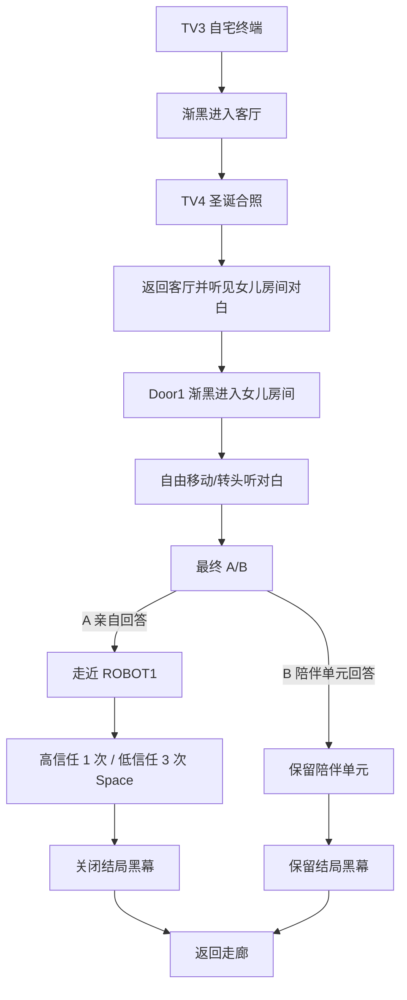

# HEARTH 17F04 自宅终局制作日志

## 文档用途

- 记录第四关当前已经落地的场景结构、状态机、UI、交互、文本资产和验收结果。
- 后续修改 17F04 前，先读本文件，再读 `HEARTH_剧情变更记录.md` 与 `HEARTH_剧情接口与可接入点.md`。
- 本文件记录当前制作事实；如与旧策划描述冲突，以最新剧情变更记录和当前 Unity 场景为准。

## 2026-07-14 制作基线

- 当前场景：`Assets/Scenes/SampleScene.unity`。
- 正式人类控制器：`Player/Person Controller`。
- 位置/视角参考：`Player/Person Controller (3)` 为客厅，`Player/Person Controller (2)` 为女儿房间。
- 正式终局控制器：`MIN_LOOP_ROOT/Finale_17F04/Hearth17F04FinaleController`。
- 当前允许直接进入第四关：`Require Previous Households = false`。
- 第四关最终选择不改变信任，只读取前三户结果。

## 流程图

## 状态机验收表

| 阶段 | 玩家控制 | 可交互对象 | 进入条件 | 退出条件 | 当前状态 |
| --- | --- | --- | --- | --- | --- |
| `Inactive` | 正常 | TV3 | 默认 | TV3 Custom Action | 完成 |
| `HomeTerminal` | 终端锁定 | TV3 页面 | 看向 TV3 按 E | Space | 完成 |
| `LivingRoom` | 可移动/转头 | TV4；后续 Door1 | 进入客厅 | 完成照片和客厅对白 | 完成 |
| `Photo` | 锁移动/转头 | Space/Esc 退出 | TV4 按 E | 照片对白完成后退出 | 完成 |
| `DaughterRoom` | 转场锁定 | 无 | Door1 按 E | 渐亮完成 | 完成 |
| `Dialogue` | 可移动/转头 | 当前剧情允许项 | 进入女儿房间 | 对白完成 | 完成 |
| `FinalChoice` | 锁移动/转头 | A/B | 女儿房间对白结束 | 首次有效选择 | 完成 |
| `ApproachUnit` | 可移动/转头 | ROBOT1 | A 路线对白结束 | 对机器人按 E | 完成 |
| `Shutdown` | 锁移动/转头 | Space | ROBOT1 按 E | 挑战完成 | 完成 |
| `Epilogue` | 黑幕锁定 | 无 | B 路线或关闭完成 | 黑幕文本结束 | 完成 |
| `Complete` | 返回走廊 | 后续系统 | 结局结束 | `onFinaleCompleted` | 完成 |

## 场景对象表

| 对象 | 当前用途 | 可手动调整内容 | 不应修改 |
| --- | --- | --- | --- |
| `17F/ROOM4/TV (3)` | 自宅入口终端 | TV/固定相机位置、屏幕整体缩放 | 不再挂 17F02 终端 |
| `17F/ROOM4/TV (4)` | 圣诞合照相框 | 相框固定相机、照片 Renderer/材质 | 不再挂终端控制器 |
| `17F/ROOM4/Door_2_Brown (1)` | 女儿房间传送交互 | Collider 范围 | 不播放门板开门动画 |
| `GameObject/ROBOT (1)` | A 路线关闭对象 | 模型位置、实体/交互碰撞体大小 | 不挂 17F03 遗留流程 |
| `Anchor_Mia_17F04_LivingRoom` | 客厅到达点 | Anchor 根与 `CameraPose` | 不移动参考控制器代替正式玩家 |
| `Anchor_Mia_17F04_DaughterRoom` | 女儿房间到达点 | Anchor 根与 `CameraPose` | 同上 |
| `Anchor_Mia_17F04_CorridorReturn` | 结局返回点 | Anchor 根与 `CameraPose` | 缺失时才用保存位置 |
| `Player/Person Controller (2)/(3)` | 编辑参考 | 可保留作机位对照 | Play 时不可作为正式控制器 |

## UI 与资源

### TV3 自宅终端

- Prefab：`Assets/Prefabs/UI/HearthHud/Terminals/Terminal_17F04_Home.prefab`。
- 内容：`HOME ACCESS / 17F-04 / YOU ARE HOME / SPACE ENTER HOME`。
- 保留：0.5 秒进入/退出平移、暗屏、开机闪烁、Space/Esc 键盘流程。
- 操作类型：`HearthTvTerminalController.PrimaryAction.Custom`。

### TV4 相框

- 材质：`Assets/materials/Hearth/17F04_Photo_Unlit.mat`。
- 当前图片：`Assets/ChatGPT Image Jul 14, 2026, 10_10_35 AM.png`。
- 使用 Unlit 主纹理显示；照片固定相机负责正面观看。
- 完成相框对白前 Door1 不开放。

### 第一人称 A/B 与关闭页

- A：`ANSWER LILY YOURSELF`。
- B：`LET THE COMPANION ANSWER FOR HER`。
- HUD 只发送事件，由 17F04 控制器决定后续，不进入旧结局流程。
- High 关闭：一次 Space。
- Low 关闭：三段警告、三次 Space。

### 黑幕

- 根节点：`MIN_LOOP_ROOT/Finale_17F04/UI/FinaleBlackout_17F04`。
- 字幕：`EpilogueDialogue_17F04`，文字在 16:9 正中央，宽约屏幕三分之二。
- 四种组合分别使用独立 Dialogue Sequence，不在运行时代码里拼接大段文本。

## Dialogue Sequence 清单

- `17F04_HomeGreeting_High / Low`
- `17F04_ChristmasPhoto`
- `17F04_HearingDaughterRoom`
- `17F04_DaughterRoom_High / Low`
- `17F04_AnswerSelf`
- `17F04_CompanionAnswer`
- `17F04_Shutdown_High / Low`
- `17F04_Epilogue_High_Retain / High_Shutdown`
- `17F04_Epilogue_Low_Retain / Low_Shutdown`

所有资产位于 `Assets/Data/MinLoop/Dialogues/17F04/`。每句可修改说话人、正文、开始等待、显示时长和音频。

## 工具使用

### 应用

1. 退出 Play Mode。
2. 运行 `Tools / Hearth / Finale / Apply 17F04 Home Finale Setup`。
3. 等 Unity 编译和保存场景。
4. 运行 Validate。

Apply 会清理 TV3/TV4 错误的 17F02 终端并补齐引用，但保留同名 Anchor、TV 相机、角色和用户手调 Transform。

### 验证

- 菜单：`Tools / Hearth / Finale / Validate 17F04 Home Finale Setup`。
- 检查：必需对象、错误终端残留、Door7 玩家直开、重复 Camera、重复 AudioListener。
- 当前结果：`Validation passed. Enabled cameras: 1, enabled AudioListeners: 1.`

## 2026-07-14 MCP 运行验收

- Unity 脚本强制编译通过，无本次新增 C# Error。
- TV3 内容在 1920x1080 内未越界。
- TV4 照片正面显示、比例稳定，字幕无大黑框。
- 相框未完成时 Door1 不可用；完成后开放。
- Door1 传送到女儿房间 Anchor，位置误差约 `0.014m`。
- 女儿房间 `Dialogue` 阶段移动、视角、交互均保持开启。
- `FinalChoice` 阶段控制锁定，A/B 只接受一次。
- A 路线恢复移动并开放 ROBOT1；B 路线不开放。
- High 一次提交结束；Low 三次提交按三段警告推进。
- 控制锁不再产生 Kinematic Rigidbody 速度写入警告。
- 17F03 与 17F04 验证菜单均通过。

## 已知旧项目问题

- 部分旧门仍有 `The referenced script ... is missing` 警告。
- 旧第三方 Animator 仍可能报告不存在的 State/Layer。
- 部分旧 BoxCollider 位于负缩放层级，会产生 negative scale 警告。
- `MinLoopWorldGuideMarker` 使用中文标签但默认 LiberationSans SDF 缺中文字符，会出现方框和字体警告。
- 上述问题不是 17F04 新状态机产生；后续应分别做旧门 Missing Script 清理、Animator 资产审计、Collider 正缩放整理与中文 TMP 字体接入。

## 后续完善接口

- 第二张照片：新增 Dialogue Sequence、固定相机或同一相框的照片数据切换。
- 语音：拖入各句 `Voice Clip`，再把字幕 AudioSource 接到 AudioMixer Group。
- 存档：保存 `CompletedHouseholds`、信任分数和终局完成状态。
- 低信任小游戏：继承 `HearthShutdownChallenge` 替换 `HearthSequentialShutdownChallenge`。
- 结局去向：在 `OnFinaleCompleted` 接主菜单、结局动画、成就或下一场景。
- 前三户门槛：勾选 `Require Previous Households`，并确保前三户完成时调用 `MarkHouseholdCompleted`。

## 2026-07-15 镜头交接修复验收

- TV3 按 Space 的同一帧，活动相机仍为 `17F/ROOM4/TV (3)/Camera`，终端保持打开并进入 handoff pending，黑幕从该视角开始渐入。
- 黑幕完成后终端才关闭，正式玩家被移动到 `Anchor_Mia_17F04_LivingRoom`，再从黑幕渐亮。
- 到达客厅后正式玩家相机本地位置为 `(0, 1.488, 0)`，没有保留跨房间的世界坐标偏移。
- 运行时把玩家视角水平转动 45 度后，相机相对控制器的水平旋转半径实测为 `0.000000`，确认围绕头部枢轴旋转。
- Unity 强制编译无新增 Error；Console 只保留第三方旧脚本警告和 MCP WebSocket 旧提示。

## 2026-07-15 A/B 输入、相框对白与猫咪引导验收

### 当前实现

- `FinalChoice` 操作改为 `↑/↓` 循环 A/B、`Space` 提交；左右键、字母 A/B、Return 在第四关选择页被临时禁用。
- 客厅渐亮后相框立即开放，欢迎对白、猫咪路线和玩家移动并行。
- 欢迎对白期间可立即进入 TV4 相框视角；照片对白排在欢迎对白之后播放，字幕共用同一播放器但不重叠。
- `CatMoveRoot` 是唯一正式猫；`CatMoveRoot (1)-(7)` 已归到 `MIN_LOOP_ROOT/Finale_17F04/CatGuide` 并标记为运行时隐藏参考。
- 正式动作使用 `A_Cat_Move.fbx` 的 `Walk_F / Run_F` 与 `A_Cat_Rest.fbx` 的 `Lie_to / Lie_idle`，不再使用旧 Preview Animator、Legacy Animation 或 `Drop_L_sit`。
- 6→7 的落点由父级抛物线控制，动作只负责身体表现，最终强制对齐参考点。

### 可调入口

- 路线位置与朝向：直接调 `CatMoveRoot (1)-(7)`。
- 每段时间、动作类型和跳跃高度：正式猫 `Hearth17F04CatGuideController` 的 `Route Steps / Jump Arc Height`。
- 起点：移动正式 `CatMoveRoot` 后点击 `Capture Current Pose As Start`。
- 动作资源：正式猫 `HearthActorAnimationPlayer / Clips`。
- 工具：`Apply 17F04 Cat Guide Setup` 与 `Validate 17F04 Cat Guide Setup`。

### MCP 验收结果

- Unity 编译无新增 Error。
- 自动验证：`guide=True / cats=8 / refs=7 / route=7 / animator=True / enabledLegacy=0`。
- Play Mode 完整路线结束：`HasReachedPhoto=True`、`IsRunning=False`。
- 第 7 点落地误差：位置 `0.00000m`，朝向 `0°`。
- 测试截图只用于现场视觉核对，不作为游戏资源保留。

## 2026-07-16 猫咪原地走路与路线加速

- 已确认原始 `Walk_F` 包含前向根位移：`RootT.z` 单次循环约从 `0` 到 `0.3844`，与父级路线移动叠加时会在循环边界产生卡顿感。
- `Walk_F` 已单独启用 `Root Transform Position (XZ) / Bake Into Pose`，现在只负责原地走路动作；猫咪世界位移统一由 `CatMoveRoot` 路线控制。
- `Run_F` 的导入设置保持不变，最后一段继续由 `Run_F` 身体动作配合父级抛物线完成跳上沙发。
- 七段时长从 `3 / 3 / 3 / 3 / 15 / 1 / 1` 缩短为 `1.5 / 1.5 / 1.5 / 1.5 / 7.5 / 0.5 / 0.5`，整体速度为原来的 2 倍。
- `Apply 17F04 Cat Guide Setup` 会把旧默认时长自动迁移到新值，但不会覆盖用户已经手动修改过的其他时长，也不会覆盖任何猫咪参考点 Transform。
- `Validate 17F04 Cat Guide Setup` 已通过，并会继续检查原地走路设置、七段时长、正式猫、参考猫和四个动作片段。
- MCP Play Mode 完整路线复测：约 `17.96` 游戏秒时已经结束趴卧流程，`IsRunning = false`、`HasReachedPhoto = true`，第 7 点位置误差 `0.00000m`、朝向误差 `0°`，没有新增猫咪控制器 Warning/Error。
- 单独循环 `Walk_F` 的运行时检查结果为 `Animator.deltaPosition = (0, 0, 0)`，确认走路动作不会再自行推动正式猫的位置。

## 2026-07-16 猫咪剩余卡顿修正

- 二次测量确认剩余卡顿来自两处：`Walk_F` 每 `1.667s` 被旧播放器手动跳回起点，以及路线点存在约 `88° / 97° / 114.5°` 的急转和最高约 `2.2` 倍的相邻段速度变化。
- `Walk_F` 已开启 `Loop Pose`；动画 Slot 已开启 `Seamless Loop`，现在由 Unity 连续循环采样，不再手动把播放时间归零。
- 路线位置改为具有连续节点速度的 Hermite 插值，`Path Smoothing` 默认 `0.75`；第 6 到第 7 点仍叠加原有跳跃弧线。
- 路线朝向使用平滑缓入缓出，经过参考点时不再瞬间切换角速度；每个参考点的最终位置和朝向仍会精确到达。
- MCP Play Mode 完整复测：`Walk_F` 长度 `1.667s`，路线结束后 `IsRunning = false`、`HasReachedPhoto = true`，猫咪相关 Warning/Error 为 `0`，测试结束后已退出 Play Mode。

## 2026-07-16 Walk_F 步频与剧情音效空槽

- `Hearth17F04CatGuideController` 新增 `Walk Playback Speed`，当前设为 `2.0`。只加快 `Walk_F` 腿部动作，路线时长、`Run_F` 跳跃和两个趴卧动作不变。
- 当前第 4、5、6 个参考点继续由运行时直接读取，重跑绑定工具未覆盖其位置或朝向。
- MCP 独立路线预览到达第 7 点：`HasReachedPhoto = true`，最终位置为 `(-2301.916, 112.297, 562.254)`，与当前第 7 点一致。
- 正式猫和七只参考猫的旧 Legacy `Animation` 已移除；Play Mode 不再出现 `Drop_L_sit must be marked as Legacy`。
- `MIN_LOOP_ROOT/Audio/StorySFX_17F04` 新增相框记忆提示和陪伴单元关机两个空 Clip 槽。猫咪不配置声音。
