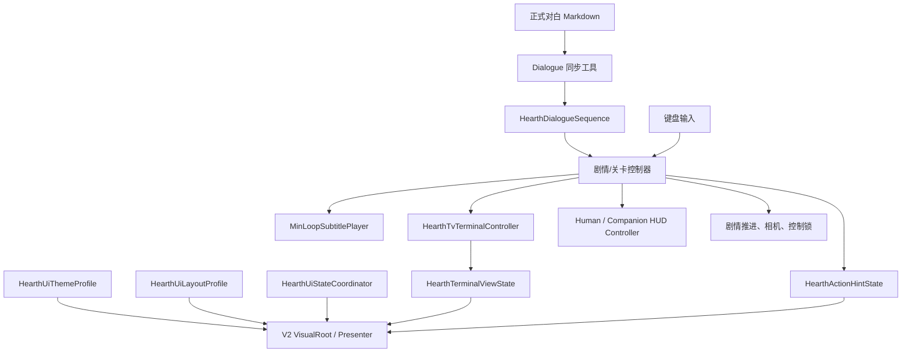

# HEARTH UI V2 全系统结构与实施基线

> 更新日期：2026-08-01
> 适用场景：`Assets/Scenes/SampleScene.unity`
> 设计参考空间：1920 × 1080

## 1. 本文用途

第二套 UI 是完整系统重构，不是在旧 UI 上继续叠加图片。本文是后续制作、代码接入、视觉替换和验收的共同入口；如果聊天记录、旧截图或旧 Builder 规则与本文冲突，应先按下面的真值顺序重新核对。

## 2. 真值优先级

1. 用户最新要求、`HEARTH_剧情变更记录.md` 和当前可运行状态机。
2. 根目录正式对白 `HEARTH_Full_Game_Script_No_Audio_Tags_Native_English.md`。
3. `UI参考资料/HEARTH_UI_Fullscreen_Mockups/` 的 11 张 1920 × 1080 图：布局、比例、信息层级。
4. `UI参考资料/HEARTH-Night-Rounds-Master.pptx`：终端色调。
5. `UI参考资料/HEARTH-HUD改(3).pptx`：Human HUD、终局和模态视觉。
6. 旧 40 页 PPT：仅补充历史用途。
7. `Assets/UI/HEARTH/GeneratedParts/` 和调试截图：不是设计真值。

禁止把白底、定位细框、角落示意框、烘焙文字和重复全屏框带入成品。终端只保留场景中实体电视的外框。

## 3. 总体依赖关系

边界规则：

- 输入、剧情执行、相机与控制锁继续由现有控制器拥有。
- Presenter 只显示状态，不直接读取按键，不自行推进剧情。
- 正式对白仍走 `Markdown → 同步工具 → HearthDialogueSequence → MinLoopSubtitlePlayer`。
- 2026-07-27 的终端 Context、布局和文字容量收口没有修改正式对白 Markdown。
- 教程和操作提示不得借用字幕播放器。
- V2 Prefab 保留功能 Wrapper、场景引用和剧情绑定；视觉都放在可替换的 `VisualRoot`/`V2_` 子树。

## 4. 全局层级与互斥

从高到低：

1. `Takeover`：安全、关机、低信任接管。
2. `Modal`：最终选择、确认框、照片档案等模态页。
3. `Terminal`：大厅、门口、自宅终端视觉根。
4. `Dialogue`：正式人物或 Field Unit 字幕。
5. `Interaction`：动态 E、Hold E、选择提示。
6. `Persistent`：身份、任务、地点等常驻 HUD。

解析规则：

| 当前状态 | Persistent | Dialogue | Interaction | Terminal | Modal | Takeover |
|---|---:|---:|---:|---:|---:|---:|
| 正常 Human Gameplay | 开 | 按需 | 无对白时开 | 关 | 关 | 关 |
| 正式对白 | 开 | 开 | 关 | 关 | 关 | 关 |
| 任意终端 | 关 | 仅终端所属对白 | 关 | 开 | 关 | 关 |
| Human Tab / 普通模态 | 关 | 关 | 关 | 关 | 开 | 关 |
| Shutdown / Low Trust | 关 | 关 | 关 | 关 | 关 | 开 |

初始教程不是常驻 HUD：被对白、Tab/模态、终端、非 Human 视角或控制锁压制时，立即隐藏并暂停计时；恢复有效 Gameplay 后继续累计剩余时间。

Companion 内部信息也遵守“临时高于常驻”：Trigger Card 从开始淡入到淡出完成期间，
常驻 Status Panel 隐藏；Card 完成后仅在当前 SceneData 有非空 Status 内容时恢复。
TriggerCardView 的 OnDisable、空 TimedCues 与缺失 CanvasGroup 都必须收敛到安全隐藏，
不能在切换视角或停用对象后遗留“临时卡仍可见”的状态；空 SceneData 不显示状态卡。

## 5. 1920 × 1080 共用坐标

坐标均为左上原点，正式值记录在：

`Assets/UI/HEARTH/V2/Profiles/Hearth_UiV2Layout_1920x1080.asset`

| 区域 | X | Y | W | H |
|---|---:|---:|---:|---:|
| 全局安全区 | 48 | 40 | 1824 | 1000 |
| 终端安全区 | 96 | 64 | 1728 | 968 |
| Human 身份 | 64 | 48 | 432 | 96 |
| Human 当前任务 | 1340 | 42 | 520 | 88 |
| Human 地点 | 64 | 944 | 360 | 80 |
| 正式对白正文 | 480 | 670 | 960 | 256 |
| 正式对白左姓名签 | 480 | 622 | 340 | 48 |
| 正式对白右姓名签 | 1100 | 622 | 340 | 48 |
| Field Unit 辅助通讯 | 1216 | 214 | 640 | 400 |
| Lily 专用语音消息 | 右边距 64 | 150 | 540 | 300 |
| Human Tab 页面外框 | 400 | 160 | 1120 | 760 |
| Human Today 内容框 | 外框内 130 | 外框内 238 | 860 | 420 |
| Human History 内容框 | 外框内 130 | 外框内 230 | 860 | 320 |
| Human History 指标框 | 外框内 130 | 外框内 560 | 860 | 150 |
| Human Settings 内容框 | 外框内 130 | 外框内 220 | 860 | 340 |
| Human Settings 底栏框 | 外框内 130 | 外框内 570 | 860 | 150 |
| Companion 身份 | 60 | 42 | 430 | 88 |
| Companion REC | 顶部居中 | 28 | 220 | 30 |
| Companion Current Task | 1340 | 42 | 520 | 88 |
| Companion Subject Monitoring | 52 | 160 | 520 | 240 |
| Companion Synth Voice | 1348 | 160 | 520 | 216 |
| 初始教程 | 1136 | 928 | 720 | 96 |
| 动态交互提示 | 660 | 688 | 600 | 64 |
| 终端标题与导航 | 120 | 72 | 1680 | 140 |
| 终端主动作 | 1480 | 148 | 320 | 56 |
| 终端内容区 | 120 | 232 | 1680 | 528 |
| 终端消息通道 | 320 | 790 | 1280 | 120 |
| 终端底栏 | 96 | 920 | 1728 | 64 |

所有 Canvas 使用 `Scale With Screen Size` 和 1920 × 1080 参考分辨率。
2026-07-31 已用真实 Game View 对 1280 × 720 的 Human Formal 与
2560 × 1440 的 Companion Decision 完成代表性缩放验证；共享锚点、全屏框和正式对白
未漂移。完整剧情流程仍由用户之后亲自测试。

## 6. 11 类界面职责

| 参考图 | 剧情用途 | 主要运行入口 |
|---|---|---|
| Base Human HUD | Human 身份、任务、地点、对白安全区、短时教程 | `HearthFirstPersonHudController` |
| Base Companion HUD | 机器人检查、状态与 Hold E | `HearthCompanionHudController` |
| Base Doorway Terminal | 17F01/02/03 门口资料、回放/入户动作 | `HearthTvTerminalController` |
| 01 Lobby Task Terminal | 领取当晚任务；前 5 秒等待 | `HearthLobbyFlowController` |
| 02 Human Tab Menu | Tonight、History、Settings | `HearthFirstPersonHudController` |
| 03 Entity Robot Inspection | 实体机器人诊断与处置 | `HearthCompanion17F03ReplayController` → 场景内 `Hearth17F03InspectionPanel`（V2 Theme） |
| 04 Home Terminal | Lily 留言和 `ENTER HOME`；Finale Apply 保持 V2 Wrapper | 17F04 Terminal Controller |
| 05 Photo Archive | 电子照片与翻页接口 | `HearthPhotoFrameInteractable` 的真实 Photo Camera → Human `Slide07/08` 实时视口 |
| 06 Final Choice | 最终 A/B 决定 | Human HUD Final Choice |
| 07 Shutdown Confirm | 高信任关机确认 | `HearthVirusPopupShutdownChallenge` → Human `Slide10` |
| 08 Low Trust Challenge | 低信任无限弹窗接管 | `HearthVirusPopupShutdownChallenge` 动态三波弹窗 |

17F01/02 顶栏动作固定为 `REVIEW ARCHIVED EVENT`；17F03 为 `ENTER UNIT`；17F04 为 `ENTER HOME`。动作在所有相关页面都可见，剧情锁定时显示 `PLEASE WAIT`，不能移到最后一页或直接消失。

大厅 Assignment Terminal 是非住户终端，住户 ID必须为空，不得被兜底识别为 17F01。
Lily 留言是大厅 Overlay 的专用 `540×300` 右上消息卡；对应 Dialogue 行只负责语音、
Manual Space 门控和剧情完成事件，不得再生成下方 Formal 对白框。
Final Choice 只保留 `FocusLayer/FinalChoiceInputHint` 这一套由真实输入状态驱动的提示；
Companion 的 `PersistentInfoLayer/V2_StatusPanel` 由 SceneData 动态写入并绑定到正式 Controller。
`HearthCompanionTriggerCardView.VisibilityChanged` 是 Trigger Card 与 Status Panel
互斥的唯一显示信号；挂载和 Inspector 关系不变。

17F04 Finale Apply 的结构不变量：

- `Terminal_17F04_Home_V2.prefab` 存在时，`TV (3)` 必须使用该 V2 Wrapper，
  不允许回退到 Legacy Home Terminal。
- Home Terminal 必须绑定唯一 `ViewSwitchController`、共享 `HearthPlayerControlLock`、
  `TV (3)` hardware root、TV 自有 World Camera 和相同的 Canvas `worldCamera`。
- Apply 后 V2 Marker 必须有效，Open Scene UI Validator 必须继续得到
  Human、Companion、Lobby、17F01–17F04 共 `7/7 V2`。

三条特殊流程不允许由 Presenter 自行推进剧情：

- 17F03 检查面板继续把 Recall、关闭和 A/B 结果交给 Replay Controller。
- Photo Archive 的左右键、贴图页和退出门控继续由相框交互器处理；Human HUD Input 在查看期间停用，
  防止其“任意键关闭故事页”抢占流程。
- 高信任 Slide10 只回传 Challenge 的完成/取消事件；17F04 Finale Controller 仍是剧情状态机所有者。

## 7. 输入归属

### Human

- `Tab`：打开/关闭 Human 菜单。
- `E`：只由当前世界交互器处理。
- 初始教程只显示 `WASD / MOUSE / E / TAB`，不显示 `SPACE CONTINUE`。

### 终端

- 终端不使用 `Tab` 翻页；`Tab` 只属于 Human/Companion 菜单。
- `Left / Right`：在当前终端顶部可用焦点之间移动。
- `Space`：只执行当前可执行动作。
- `Esc`：在流程允许退出时退出；强制回放/决策阶段不可退出。

大厅终端保持原流程：

- 页面出现后的前 5 秒：`PLEASE WAIT`。
- 5 秒后：`SPACE CLOSE TERMINAL`。
- Space 不再承担“接受任务后继续对白”的错误视觉语义。

## 8. 视觉与素材规则

主题资产：

`Assets/UI/HEARTH/V2/Profiles/Hearth_UiV2Theme.asset`

基础色：

- 深蓝黑：`#0B1018`、`#09101C`
- 灰蓝：`#5F7895`
- 冷白：`#D7E6F6`
- 信息蓝：`#78AADC`
- 琥珀、绿色、红色仅用于警告、成功、危险等语义。

制作边界：

- 动态底板使用 Unity `Image`、2px 规则线和 TMP。
- AI/Image2 只制作透明、固定用途、无文字的装饰。
- 普通键帽约 64 × 40；Space 约 96 × 40。
- 动态框体不得使用包含内部线条的整张大图。
- 任何新 PNG 必须先记录目标像素、透明区、文字安全区和 9-slice 边界。
- 本轮固定用途边框统一为外线 2px、内线 1px、间隔 6px；信息蓝使用
  `#78AADC`，外线约 85% 不透明、内线约 45%。
- 边框 SVG/PNG 不含文字、衬底、白底、斜线或多余透明边距；每个尺寸独立输出，
  不允许把 520×320 素材强行压缩成其他比例。
- 半透明衬底相对边框至少缩进 6px，文字相对边框安全边距统一为 24px。
- TMP 关闭自动缩字；正式正文使用 `Overflow`，不使用 `Ellipsis` 或 `Truncate`。
- Field Unit、Lily、Human Tab 内容区分别使用用途明确的独立 Frame；不要把旧
  `HUD_Feedback_FieldUnitToastFrame_640x180` 重新接回正式 Subtitle Prefab。
- Final Choice、Shutdown Confirm、Low Trust Warning 的 V2 Style 必须禁用页面内
  所有旧 `Border_*` Image（透明、disabled、无 Raycast），只保留真实按钮、焦点和 V2 规则线。

## 9. 字幕容量

- 标准说话人：28px。
- 标准正文：26px。
- Centered Epilogue 说话人：30px。
- Centered Epilogue 正文：28px。
- Time Card 正文：34px，不显示说话人。
- 人物对白使用较宽区域；Field Unit/终端消息可以较窄。
- 正式对白使用 `960×256` 固定框；Field Unit 使用 `640×400` 固定框并保留长句余量。
- 人名与正文的左边界和 Rect 均可在 `MinLoopSubtitlePlayer` Inspector 中按 1920 坐标手调。
- 最长 201 字符与全部超长正式对白必须完整显示，不拆句、不改稿。
- Advance Hint 必须反映 Dialogue Asset 的真实策略；Lily AudioOnly 留言允许显示
  `SPACE SKIP MESSAGE`，普通自动对白不得错误显示 Space 提示。

字幕视觉 Prefab：

`Assets/Prefabs/UI/HearthSubtitle/V2/HearthSubtitleVisualCanvas_V2.prefab`

字幕样式资产：

`Assets/Data/MinLoop/UI/Hearth_SubtitleStyle.asset`

## 10. 安全制作流程

每个 UI 动手前必须明确：

1. 剧情用途。
2. 触发、锁定与退出条件。
3. 所属层级。
4. 1920 坐标和安全区。
5. 最长真实文字容量。
6. 当前输入状态。
7. 素材透明区与拉伸方式。
8. 数据绑定来源。
9. 目标截图和最小运行测试。

本轮定向视觉修复只使用：

- `Tools > Hearth > UI V2 > Final Repair > Apply Visual and Structure Repair`
- `Tools > Hearth > UI V2 > Final Repair > Validate Repaired Prefabs`

一楼大厅只修复 Lily 卡片和对白输入语义时使用：

- `Tools > Hearth > Lobby > Repair Opening Message UI And Input`

只有首次缺少 Theme/Layout/Coordinator/教程根，或 System Validator 报缺失时才执行：

`Tools > Hearth > UI V2 > System > Install Profiles And Human Tutorial`

最后执行：

- `Tools > Hearth > UI V2 > Validate Open Scene UI`
- `Tools > Hearth > UI V2 > Subtitles > Validate Open Scene`
- `Tools > Hearth > UI V2 > System > Validate Profiles And Human Tutorial`
- `Tools > Hearth > Validation > Validate Runtime Topology`

禁止把 `Rebuild All V2 UI Assets` 或 `Use V2 UI In Open Scene` 当作现场视觉微调按钮；前者会覆盖现场视觉树，后者会替换场景 UI 根。

若因剧情或引用维护必须重跑 `Apply 17F04 Home Finale Setup`，随后必须运行
17F04 Finale Validator 与 `Validate Open Scene UI`；不能把 Binder Apply 当成允许
单独替换 Home Terminal 版本的入口。

## 11. 当前基准截图

本轮最终目录：

`HEARTH_UI_V2_Baselines/FinalRepair_2026-07-31/`

当前最终检查重点：

- `28_Final_Human_Persistent_TitleOnly.png`
- `32_Final_Human_PhotoArchive_NoStrayRule.png`
- `23_Final_Companion_Decision.png`
- `24_Final_Companion_Formal.png`
- `25_Final_Companion_LiveAudio.png`
- `26_Final_Terminal_17F01.png`
- `27_Final_Terminal_17F04.png`
- `30_Scale_Human_Formal_1280x720_Confirmed.png`
- `31_Scale_Companion_Decision_2560x1440.png`
- `33_Final_21State_ContactSheet.png`
- `34_Final_Responsive_ContactSheet.png`
- `40_Final_Human_Tab_HeadingOnly.png`

2026-08-01 大厅与 Human Tab 增量目录：

`HEARTH_UI_V2_Baselines/2026-08-01-fix/`

- `FieldUnit_Auxiliary_640x400.png`
- `Lily_Dedicated_Voice_Message.png`
- `Tab_Today_Rounds.png`
- `Tab_Disposition_History_Final.png`
- `Tab_System_Settings_Final.png`

原 21 个标准状态和新增的 3 个 Human Tab 专页都必须来自原生 1920 × 1080 Game View；响应式抽查必须分别来自真实
1280 × 720 与 2560 × 1440 Game View，不以 Scene View 或编辑器缩放预览代替。

## 12. 完成标准

- 11 类界面都有明确职责和可用页面。
- 无双重大框、白底、烘焙文字和装饰线穿字。
- 无固定错误教程；教程随上下文变化。
- 无正式对白改写。
- 最长对白固定字号且完整。
- 顶栏动作、Tab、方向键、Space、Esc 和控制恢复全部可用。
- 大厅 Lily AudioOnly 专用卡可用 Space 跳过；Mia `Okay.` 之后 Movement、Look、
  Interaction 和 Menu 全部按共享 Mask 恢复。
- Lobby 与 17F01–17F04 全流程可跑通。
- 17F04 Finale Apply 后 Home Terminal 仍为有效 V2，七个正式 UI 槽位保持 `7/7 V2`。
- Companion 临时 Trigger Card 与常驻 Status Panel 不重复显示；Card 淡出后状态面板按数据恢复。
- Final Choice、Shutdown Confirm、Low Trust Warning 无启用的 Legacy `Border_*` 遗留细框。
- Unity Console 无本轮新增错误。
- Legacy 保留，直到 V2 全流程最终验收完成。

## 13. 2026-07-31 至 2026-08-01 视觉与结构修复状态

- 当前定向入口改为：
  - `Tools > Hearth > UI V2 > Final Repair > Apply Visual and Structure Repair`
  - `Tools > Hearth > UI V2 > Final Repair > Validate Repaired Prefabs`
  - `Tools > Hearth > UI V2 > Runtime Preview`
- 原 21 个 1920×1080 预览状态继续保留；新增 Today、History、Settings 三个 Human
  专页入口，当前可定向检查 24 个状态。
- 正式对白与 Auxiliary 已拆成独立 Frame；姓名签左右互斥。
- Human、Companion、Terminal 的基础根统一由 `HearthUiStateCoordinator` 互斥显示；
  Companion 控制器不再保存/恢复 Human HUD。
- Current Task 暂时只显示标题。逐阶段任务映射必须等待用户确认的正式文案，不能自行编写。
- Companion 的身份、REC、Current Task、Status、Decision、Formal、Boundary
  已进入统一全屏框和绝对坐标；Synth Voice 在所有章节使用同一位置。
- Doorway/Home 终端的标题、导航、正文与 Footer 已合入唯一 `TerminalVisualRoot`，
  去除旧 6/8 页、内部 A/B、重复全屏框、上下割裂背景和 17F04 重复文案。
- Human Tab 选中态改为按钮内部 `SelectionFill`；Photo Archive 使用单一连续模态底板，
  不再带出旧竖线或越界衬底。
- MCP 区域遮挡审计与 `Validate Repaired Prefabs` 当前通过；最后一次 Console 无本轮新增
  错误或警告。
- 2026-07-31 只验证 Runtime Preview、Prefab 结构、缩放与主要区域遮挡；
  2026-08-01 另跑通一楼大厅开场对白至 `FreeExploration`，并核对最终控制 Mask。

## 14. 2026-08-01 大厅对白与 Human Tab 增量基线

- `MinLoopSubtitlePlayer` 是 Formal/Auxiliary 字幕布局的唯一运行时所有者；新增的 11 个
  `Rect` 字段是 1920×1080 坐标真值。后续手调人物名称位置应改 Inspector，不能直接改
  生成 PNG，也不能复制第二套播放器。
- Field Unit 当前 Frame、Backdrop、Speaker、Body、Advance Hint 分别为：
  - `1216,214,640,400`
  - `1222,220,628,388`
  - `1248,242,560,40`
  - `1248,300,560,236`
  - `1584,570,224,24`
- Lily 展开消息卡右边距 64、顶部 150、尺寸 `540×300`；收起状态尺寸 `540×84`。
  卡片正文由 `HearthLobbyHudOverlay` 显示，`Lobby_LilyVoiceMessage.asset` 保持
  Auxiliary + AudioOnly + Manual Space。
- Human Today、History、Settings 共用 `1120×760` 外框，但内容/指标框按页面内容分别布局；
  旧 `V2_TopRule` 和 Legacy `Border_*` 在这些页面关闭，避免装饰线穿标题。
- 新 Frame 资源必须保持透明、无文字、无白底：Field `640×400`、Lily `540×300`、
  Human Page `1120×760`、Content `860×420`、Metric `860×132`。Vector Import Validator
  当前期望 39 个 Sprite。
- 控制恢复由 `HearthPlayerControlLock.CombinedActiveMask` 与
  `ViewSwitchController.RefreshControlsFromLockState()` 共同收敛。任何新 Dialogue/Modal/
  Terminal 只能以 Owner 申请 Mask，退出时释放 Owner；不得直接把移动、视角或交互组件永久关闭。
- 已用 Unity MCP 验证：Prefab Validator 通过；Field/Lily/Today/History/Settings 截图无越框或压线；
  大厅完成后 `stage=FreeExploration`、`mask=None`，Movement、Look、Interaction 和 Menu 为可用状态。
