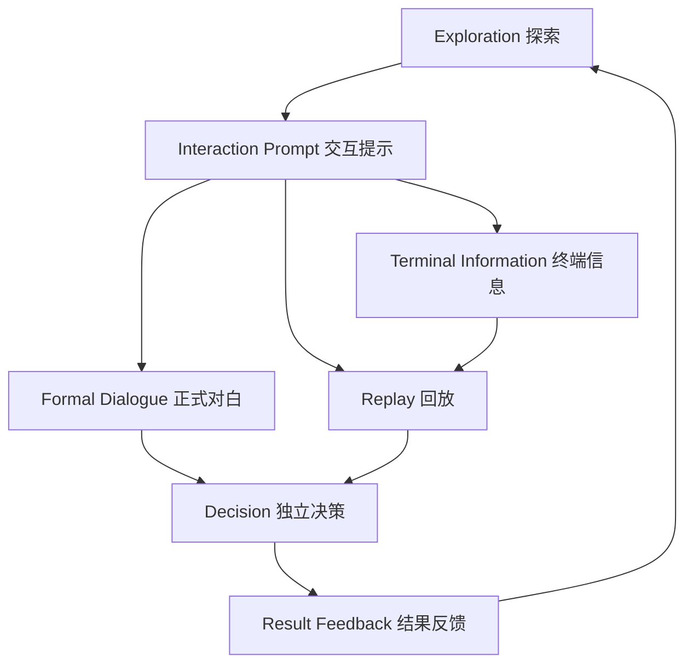

# HEARTH 下一阶段：UI 系统地图

> 目标：让每一种信息只承担一种职责，避免终端、字幕、HUD、回放和选择互相重叠。

## 一、全局层级

建议 Canvas 层级：

| 层 | 内容 | 是否常驻 |
|---|---|---|
| `PersistentHudLayer` | 身份、右侧当前任务、地点 | 是 |
| `CommsLayer` | Field Unit、Mia 轻量通讯 | 按需 |
| `InteractionLayer` | E、Hold E、Space、方向提示 | 按需 |
| `FormalDialogueLayer` | 正式人物对白 | 按需 |
| `TerminalLayer` | World Space 终端内容 | 按需 |
| `ReplayLayer` | 回放框、时间戳、目标提示 | 按需 |
| `DecisionLayer` | A/B 独立选择 | 按需 |
| `TakeoverLayer` | 黑幕、故障、结局、暂停 | 按需且最高 |

互斥原则：

- `FormalDialogueLayer` 打开时，`InteractionLayer` 只允许显示“下一句”。
- `DecisionLayer` 打开时，不显示普通 E 提示。
- `TerminalLayer` 打开时，人类 HUD 降低透明度，但当前任务可保留。
- `ReplayLayer` 打开时，人类 HUD 隐藏，陪伴单元 HUD 根据回放类型显示。
- `TakeoverLayer` 负责最终遮罩，不允许底层输入穿透。

## 二、UI 系统 A：正式人物对白

### 使用场景

- 大厅 NPC 完整事件。
- 17F 家庭关键对话。
- 17F03 回到 Mia 后的家庭说明。
- 17F04 女儿房间正式对白。
- 重要选择后的评价。

### 视觉

- 位于屏幕下方。
- 深色半透明衬底，不使用覆盖整屏的大黑框。
- 说话人名称在正文上方。
- 正文最多两行。
- 明确显示 `SPACE  CONTINUE` 或统一的下一句图标。
- 可选语音波形/声源方向，但不作为必要信息。

### 控制

- 进入时锁移动和视角。
- 第一次按 Space：若文字正在逐字显示，则立即显示完整本句。
- 第二次按 Space：进入下一句。
- 有语音时可配置：
  - 允许完整播放后再推进。
  - 或允许玩家跳过语音。
- 对话结束后恢复进入前的控制状态。

### 数据

沿用 `HearthDialogueSequence`，但建议新增：

- `DialogueMode = Formal`
- `AdvanceMode = PlayerConfirm`
- `AllowVoiceSkip`
- `LockMovement`
- `LockLook`
- `SubtitleStyleId`

## 三、UI 系统 B：Field Unit 与右侧任务系统

### 使用场景

- 任务简报。
- 路线提示。
- 终端家庭介绍。
- 分析建议。
- 选择结果评价。
- 系统警告。

### 视觉

- 右侧上方先显示当前任务，Field Unit 信息位于其下方。
- 两块使用同一条垂直对齐线，但保持清楚的标题和间距。
- 模块化窄栏，不遮挡主要视野，也不占用左侧 Tab 菜单空间。
- 明确显示来源：`FIELD UNIT`。
- 不使用人物对白的大底板。
- 正文控制在 1-3 行。
- 重要状态使用一条强调色，不堆叠多块装饰。

### 生命周期

- 简短提示：2-4 秒自动消失。
- 任务信息：更新后缩小为右侧常驻目标。
- 关键建议：持续到玩家确认或进入选择。
- 终端介绍：只在终端打开时显示。

### 当前任务文案规则

- 一条主目标 + 可选的一条子目标。
- 不显示无功能的伪数据。
- 目标变化时短暂强调，随后降为常驻低亮度。
- 使用动词开头。
- 一次只告诉玩家下一步。
- 不提前泄露后续剧情。
- 可交互对象名与实际场景名一致。

示例：

| 阶段 | 主目标 | 子目标 |
|---|---|---|
| 大厅开始 | `CHECK THE ASSIGNMENT TERMINAL` | `Optional: Observe lobby residents` |
| 领取任务后 | `PROCEED TO THE ELEVATOR` | `Call the elevator for Floor 17` |
| 17F01 门口 | `INSPECT 17F-01` | `Review the household terminal` |
| 回放中 | `REVIEW THE ARCHIVED EVENT` | `Face Noah and hold E` |
| 回放后 | `MAKE A DISPOSITION` | `Review the evidence before choosing` |

### 状态来源

任务不能由 HUD 自己猜测，必须由统一剧情状态发布：

`GameFlowState -> ObjectiveService -> ObjectiveView`

## 四、UI 系统 C：左侧 Tab 菜单

### 已有功能

- `TODAY`：查看今晚巡查任务。
- `DISPOSITION HISTORY`：查看已完成住户及信任度变化记录。
- `SYSTEM SETTINGS`：调整 Master、Dialogue、Ambient、SFX，并进入退出确认。

### 视觉与操作

- 左上身份区下方作为 Tab 菜单展开空间，不再放常驻任务。
- 探索时只保留低干扰的身份装饰；按 `Tab` 后展开三个菜单项。
- `Up / Down` 移动焦点，`Space` 确认，`Esc` 或再次 `Tab` 关闭。
- 打开菜单和子页面时锁定玩家移动，关闭后恢复。

## 五、UI 系统 D：终端系统

### 新职责

终端只负责：

1. 身份和家庭核心信息。
2. 当前异常。
3. 一个关键趋势或时间线。
4. 进入回放/入户。

不再负责：

- 最终 A/B。
- 长篇评价。
- 信任度结算。
- 下一户指引。

### 页面数量

建议每户 1-2 页：

**Page 1：Summary**

- 住户。
- 陪伴单元服务类型。
- 核心异常。
- 最近检查。
- 主操作。

**Page 2：Evidence**

- 一条关键时间线。
- 一条信任趋势。
- 一条 Field Unit 解释。

### 当前 24 页迁移原则

PaddleOCR 核对显示当前每户 8 页，信息可以压缩：

| 当前栏目 | 新位置 |
|---|---|
| Resident Summary | Page 1 |
| Acquisition | 可选短句或档案页 |
| Family Log | Page 2 关键事件 |
| Trust Trend | Page 2 一张图/一行结论 |
| Inspection History | 只保留最后一次异常 |
| A/B | 移到 DecisionLayer |

原 PNG 保留为视觉与文字校对参考，不再作为最终动态文本容器。

### 交互

- Tab 或左右键在 1-2 页切换。
- Space 执行主操作。
- Esc 退出。
- 不显示不能使用的鼠标。
- 首次打开显示一次键位教学。

## 六、UI 系统 E：独立选择与决策

### 出现时机

必须满足：

1. 终端资料已查看。
2. 回放/入户已经完成。
3. Field Unit 建议已经播放。
4. 当前没有其他正式对白。

### 视觉

- 独立于终端屏幕。
- A/B 垂直或水平布局必须全局统一。
- 每个选项包含：
  - 行动名称。
  - 一句结果说明。
  - 当前高亮。
  - 是否为 Field Unit 推荐。
- 选择提交前显示键位提示。
- 提交后立即变灰并锁定。

### 交互

- 推荐统一为 `UP / DOWN + SPACE`，更适合两项垂直决策。
- 若保留前两户左右布局，必须由输入配置明确显示，不得依赖记忆。
- 任何选择只结算一次。

### 结果反馈

顺序：

`按钮锁定 -> 信任变化 -> 角色/Field Unit 评价 -> 目标更新 -> 恢复探索`

## 七、UI 系统 F：回放系统

### 持续信息

- `ARCHIVED PLAYBACK`
- `17F-01 / 02:47`
- `ROLE: COMPANION UNIT MEMORY`
- 播放状态。
- 当前目标。

### 回放阶段

1. 进入：扫描、噪声、时间戳建立。
2. 观察：只显示轻量回放框。
3. 可交互：中央出现目标与 Hold E。
4. 事件完成：显示 Archive Complete。
5. 退出：画面中断并返回现实。

### 与陪伴单元 HUD 的关系

- 回放 HUD 使用陪伴单元底框。
- 决策、监控卡和数据流按剧情开启，不能同时全部常亮。
- 右上决策区用于“机器人当时的判断”，不是 Field Unit 现在的评价。
- 玩家当前目标仍由 ReplayLayer 统一显示。

## 八、UI 系统 G：17F04 家庭与结局

17F04 应复用前述系统，不再发展一套完全独立的 UI：

- 客厅探索：Persistent HUD + Field Unit。
- 相框：Photo View + 正式/轻量对白。
- 女儿房间：正式人物对白。
- A/B：DecisionLayer。
- 关闭陪伴单元：InteractionLayer + Shutdown Challenge。
- 结局：TakeoverLayer + Time Card + 场景化后果。

低信任弹窗玩法可以保留，但需要：

- 半透明黑色屏幕遮罩。
- 三阶段弹窗视觉差异。
- 不显示编号。
- 明确的 Space 操作反馈。
- 可配置生成速度、同时存在数量、关闭阈值和失败保护。

## 九、Mia 与 Field Unit 移动中互动：三种方案

### 方案一：自由移动通讯

- 玩家可移动、可转头。
- Field Unit 在右侧显示。
- Mia 的简短回应显示在下方轻量区域。
- 不需要逐句 Space。

适合：

- 路线指引。
- 家庭一句话介绍。
- 简短观察。
- 下一目标。

风险：

- 玩家可能错过内容。

补救：

- 重要信息同步写入左侧目标。
- 提供 Tab 通讯历史。

### 方案二：半锁定通讯

- 玩家可转头。
- 暂停移动或限制为慢走。
- 临时关闭 E 交互。
- 对白自动播放。

适合：

- 电梯内说明。
- 进入新空间时的关键系统说明。
- 玩家需要看环境但不应离开的段落。

风险：

- 频繁使用会让玩家觉得被控制。

### 方案三：小型正式对白

- 锁移动和视角。
- 逐句 Space。
- 使用正式对白底板。

适合：

- 伦理解释。
- 选择前关键事实。
- 角色冲突。

风险：

- 如果用于普通导航，会严重拖慢节奏。

### 推荐

采用混合规则：

| 内容 | 模式 |
|---|---|
| 导航、路线、简短家庭介绍 | 方案一 |
| 电梯、重要空间切换 | 方案二 |
| 人物冲突、选择前证据、结局评价 | 方案三 |

不要用“是谁在说”决定是否锁控制，应由“这句话是否要求玩家完整理解并回应”决定。

## 十、首次教学系统

教学数据建议包含：

- `TutorialId`
- `Prompt`
- `InputAction`
- `ShowCondition`
- `CompleteCondition`
- `PauseMode`
- `ShowOnce`

首轮顺序：

1. `WASD  MOVE / MOUSE  LOOK`
2. `E  INTERACT`
3. `HOLD E  COMPLETE ACTION`
4. `TAB  REVIEW TERMINAL`
5. `SPACE  CONFIRM`
6. `UP / DOWN  SELECT`

教程完成状态应单独保存，不能绑在某一关的临时 bool 上。

## 十一、设置与可访问性

共享设置至少应包含：

- Master、Dialogue、Ambient、SFX、Music。
- Mouse Sensitivity。
- Subtitle Size。
- Subtitle Background。
- Subtitle Speaker Labels。
- Hold Interaction 可替代为 Toggle。
- Input Rebinding。

微软 Xbox Accessibility Guidelines 将文字显示、对比度、字幕、输入、UI 导航、焦点和时间限制分别列为独立检查项。后续验收不应只看“有没有字幕”，还要看它是否可读、可调整、不会挡住关键 UI。

## 十二、系统边界总结

| 系统 | 回答的问题 |
|---|---|
| Persistent HUD | 我是谁、在哪、当前要做什么？ |
| Interaction Prompt | 我现在能对什么做什么？ |
| Formal Dialogue | 谁正在说什么，我何时继续？ |
| Field Unit | 系统在告诉我什么？ |
| Terminal | 这个家庭的关键信息是什么？ |
| Replay | 我正在看哪段记录、扮演什么？ |
| Decision | 我现在必须选择什么？ |
| Result Feedback | 我的选择改变了什么？ |

只要某一块 UI 同时回答三个以上问题，就应拆分。

## 十三、系统操作矩阵

| 系统 | 使用场景 | 位置 | 输入 | 锁移动 | 锁镜头 | 配音 | 可跳过 | 可重复 | 建议 Unity 模块 |
|---|---|---|---|---:|---:|---:|---:|---:|---|
| 正式人物对白 | 家庭关键剧情 | 下方 | Space | 是 | 通常是 | 是 | 可配置 | 否 | `HearthDialogueDirector` + `FormalDialogueView` |
| Mia 自言自语 | 观察与感想 | 下方轻量 | 自动 | 否 | 否 | 可选 | 不需要 | 通常否 | `HearthCommsPresenter` |
| Field Unit | 指令与建议 | 右侧 | 自动/确认 | 否 | 否 | 是 | 可配置 | 通讯历史可看 | `HearthCommsPresenter` |
| 当前任务 | 全程 | 右侧、Field Unit 上方 | 自动更新 | 否 | 否 | 否 | 不适用 | 是 | `HearthObjectiveService` |
| Tab 菜单 | 人类探索 | 左上身份区下方展开 | Tab/上下/Space/Esc | 是 | 否 | 否 | 可退出 | 是 | `HearthFirstPersonHudController` + `HearthFirstPersonHudInput` |
| 普通交互提示 | 探索 | 中下 | E | 否 | 否 | 音效 | 不适用 | 按对象 | `HearthInteractionPromptPresenter` |
| 长按交互 | 剧情动作 | 中下 | Hold E | 按剧情 | 通常否 | 音效 | 可取消 | 否 | `HearthHoldInteractionPresenter` |
| 终端 | 家庭资料 | World Space | Tab/方向/Space/Esc | 是 | 是 | Field Unit 可选 | 可退出 | 信息可重复 | `HearthTvTerminalController` + 新 Page View |
| 回放 | 历史事件 | 全屏叠层 | 视角/E/Hold E | 按剧情 | 否 | 是 | 关键段不可跳 | 否 | Replay Controller + `ArchivedPlaybackView` |
| 独立决策 | A/B | 中央 | 上下 + Space | 是 | 是 | 建议/评价 | 提交前可退出由剧情定 | 否 | `HearthDecisionController` |
| 相框 | 自宅记忆 | 固定相机 | Space 返回 | 是 | 是 | 是 | 完成后可退 | 是 | `HearthPhotoFrameInteractable` |
| 黑幕/时间卡 | 过渡与结局 | 全屏 | 自动/Space | 是 | 是 | 是 | 可配置 | 否 | `TakeoverLayer` + Subtitle Player |

说明：

- “可重复”区分信息查看和剧情结算。终端可以重复查看，但回放入口和处置结算仍需按关卡状态限制。
- “可跳过”不能等同于直接中断流程。跳过必须正确停止语音、清空 UI、释放控制锁并进入下一合法状态。
