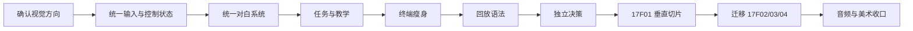

# HEARTH 下一阶段：任务清单与实施链路

> 原则：先完成设计和一个可玩垂直切片，再批量迁移。不要同时重做四关。

## 一、实施总链路

## 二、P0：下一版试玩前必须完成

### P0-01 视觉方向确认

**目的**

避免先写脚本、后反复推翻布局。

**工作**

- 从三个风格方案中选择主方向。
- 生成 14 个关键状态的视觉参考。
- 用户确认：
  - 对白位置。
  - Field Unit 位置。
  - 任务位置。
  - 终端信息密度。
  - 独立决策布局。
  - 回放标识。
- 把确认结果做成共享 Layout/Profile，不把数值散落在关卡脚本里。

**验收**

- 1920×1080 下，任何文本不越界。
- 常驻 HUD、对白、交互、终端、决策不会同时抢占同一区域。
- 视觉确认完成前不进入批量实现。

**工作量**

M

### P0-02 统一输入与控制状态

**目的**

解决关卡间 E、Hold E、Space、方向键和玩家锁定规则不一致。

**建议结构**

- `HearthInputRouter`
- `HearthControlStateService`
- `HearthInteractionPromptPresenter`
- `HearthTutorialService`

**控制状态**

| 状态 | 移动 | 视角 | E | Space | Tab |
|---|---:|---:|---:|---:|---:|
| Explore | 是 | 是 | 是 | 否 | 是 |
| Comms | 是 | 是 | 按剧情 | 否 | 是 |
| FormalDialogue | 否 | 否 | 否 | 下一句 | 否 |
| Terminal | 否 | 否 | 否 | 主操作 | 页面切换 |
| ReplayObserve | 按剧情 | 是 | 目标交互 | 按剧情 | 否 |
| Decision | 否 | 否 | 否 | 提交 | 否 |
| Transition | 否 | 否 | 否 | 否 | 否 |

**迁移方式**

- 第一阶段可保留旧 Input Manager。
- 先统一“动作名”和状态路由。
- P1 再迁移到 Unity Input System，避免一次性重写所有输入。

**验收**

- 任意时刻只有一个输入上下文生效。
- Space 不会同时关闭终端并推进对白。
- E 不会同时触发两个重叠交互体。
- 提交选择后重复按键不会再次结算。

**工作量**

L

### P0-03 统一正式对白

**目的**

把 71 个 Dialogue Asset 和 398 行对白接入一致、可控、可读的正式系统。

**工作**

- 在现有 `HearthDialogueSequence` 上增加对白模式。
- 正式对白支持：
  - 玩家逐句推进。
  - 打字显示或立即显示。
  - 语音完成策略。
  - 锁移动和锁视角。
  - 可调字幕背景。
- Field Unit/Mia 保留自动模式。
- 继续使用正式稿稳定标记同步。
- 不手工复制 398 行文本。

**语音兼容**

- 当前 398 行 `voiceClip` 均为空。
- 有语音时默认：
  - 字幕时长跟随语音。
  - 玩家可配置是否跳过。
- 无语音时：
  - 正式对白等待 Space。
  - 移动通讯使用回退时长。

**验收**

- 修改共享字幕样式后四关同步变化。
- 任何正式对白最多两行。
- 不同信息类型有明确视觉差异。
- 退出或中断不会遗留控制锁。

**工作量**

L

### P0-04 大厅公共事件改为主动 E

**目的**

让可选世界观内容成为玩家主动发现，而不是误入 Trigger 后被强制播放。

**工作**

- 现有 Trigger 只负责判断“玩家在事件范围内”。
- 玩家看向角色/事件中心并按 E 才开始。
- 开始后进入正式对白状态。
- 事件完成后标记已看，不再重复显示 E。
- Mia 离场感想仍在离开区域后播放，但不能与下一事件重叠。

**验收**

- 玩家可以绕开三个事件。
- 进入范围但不按 E 不会锁控制。
- 对话开始后能完整听完/读完。
- 已完成事件不再误触。

**工作量**

M

### P0-05 阶段驱动任务 HUD

**目的**

让玩家一直知道下一步。

**工作**

- 建立统一 Objective 数据。
- 流程控制器只发布目标 ID，不直接改 TMP 文本。
- 目标更新有 0.5 秒淡入。
- 历史目标可在 Tab 菜单查看。

**首批目标**

- 一楼出生。
- 三组可选事件。
- 任务终端。
- 电梯。
- 17F01/02/03。
- 17F04 相框、房门、选择和关闭流程。

**验收**

- 任何可游玩阶段都有且只有一个主目标。
- 目标和当前可交互对象一致。
- 进入正式对白或终端时目标不抢视觉焦点。

**工作量**

M

### P0-06 首次教学

**工作**

- E、Hold E、Tab、Space、方向选择、回放转头、相框退出。
- 每项只教学一次。
- 教学完成条件由实际输入触发。
- 提供重置教学入口。

**验收**

- 新玩家不需要口头说明即可完成 17F01。
- 已教学机制后只显示短提示。

**工作量**

M

### P0-07 终端压缩为 1-2 页

**目的**

从“PPT 信息展览”转为“可读的调查工具”。

**工作**

- 把 24 页 OCR 内容按每户压缩为 Summary/Evidence。
- 动态文本改为 TMP。
- 线框和背景改为 Unity UI/Sprite。
- 原 PNG 只作校对参考。
- 移除终端内部 A/B。
- 保留主操作、开机动画和镜头过渡。
- 终端默认不显示鼠标。

**验收**

- 玩家 20-30 秒内能说出该户的核心问题。
- 两页内能找到进入回放/入户操作。
- 字号设置能影响终端正文。
- 终端可重复查看，剧情主操作只触发一次。

**工作量**

L

### P0-08 回放模式统一

**工作**

- 建立 Archived Playback Overlay。
- 明确时间戳、角色、当前目标。
- 统一回放开始/结束效果。
- 将三户长按 E 和目标判断接入统一提示。
- 不重写现有三户剧情演出，只替换显示与状态入口。

**验收**

- 玩家能在 3 秒内判断自己正在看过去记录。
- 玩家知道当前扮演陪伴单元。
- 错误目标不显示交互。

**工作量**

M

### P0-09 独立决策系统

**工作**

- 从终端拆出 A/B。
- 选择前必须完成建议与证据。
- 默认推荐项有清楚但不过度的标记。
- 提交后立即锁定并显示结果。
- 统一信任度结算入口。

**验收**

- 每户只结算一次。
- 选择不会因多次 Space 重复加减信任。
- 玩家知道如何切换和确认。
- 选择后的评价播放完才进入下一目标。

**工作量**

M

### P0-10 17F01 垂直切片

**范围**

从大厅任务开始，完成 17F01 处置。

**目的**

验证新系统是否真的改善体验，而不是只让代码更复杂。

**验收顺序**

1. 玩家主动查看大厅事件。
2. 任务清楚。
3. 终端两页可读。
4. 回放身份清楚。
5. Hold E 教学明确。
6. 正式对白可控。
7. A/B 在独立页面出现。
8. 结果反馈清楚。
9. 下一目标出现。

只有该切片通过 2 名以上无口头指导的试玩者，才迁移其余关卡。

**工作量**

L

## 三、P1：核心体验稳定后完成

### P1-01 迁移 17F02

- 保留当前空间演出、女主路线和动作。
- 迁移共享对白、回放、Hold E、决策和目标。
- 清理关卡脚本内重复输入代码。

### P1-02 迁移 17F03

- 保留入户、实体机器人检查、两段回放和家庭反馈。
- 迁移回放目标提示与独立处置。
- 对实体机器人检查页重新设计信息层级。

### P1-03 迁移 17F04

- 保留相框、猫、女儿房间和低信任弹窗玩法。
- 迁移正式对白、独立选择、目标和教学。
- 把黑幕长文字改为时间卡 + 场景化结果。

### P1-04 音频架构

- 建立 Audio Mixer：
  - Master
  - Dialogue
  - Music
  - Ambience
  - UI
  - SFX
  - Human Footsteps
  - Companion Footsteps
- 建立 Explore/Dialogue/Terminal/Replay/Shutdown Snapshot。
- 对白时环境音 ducking。
- 终端和回放增加可配置滤波。

### P1-05 设置与输入迁移

- 鼠标灵敏度。
- 字幕字号。
- 字幕背景。
- Hold/Toggle 交互。
- Unity Input System。
- 键位重绑与输入图标。

## 四、P2：视觉与声音优化

### P2-01 完整音频路由

**影响范围**

全部关卡、终端、回放、UI 和设置。

**前置条件**

统一对白模式和输入状态稳定。

**涉及现有脚本**

- `HearthAudioSettingsController`
- `HearthAudioChannelSource`
- `HearthSfxCuePlayer`
- `MinLoopSubtitlePlayer`
- 人类/机器人 Footstep 系列

**涉及资产**

- 新 Audio Mixer。
- Dialogue Asset 中的 AudioClip 字段。
- 各终端、UI 和关卡 AudioSource。

**目标结构**

| 需求 | 当前支持 | 后续改造 |
|---|---|---|
| 每条对白独立音频 | 字段已有，0/398 已绑定 | 批量绑定与缺失报告 |
| 跳过时停止当前语音 | 部分可停 | 统一淡出和下一句 |
| 下一句立即播放 | 已有基础 | 接入玩家推进状态 |
| Human/Field/Home Unit 分组 | 无 Mixer | 建立独立 Mixer Group |
| Field Unit 弹窗 UI 声 | 有 cue 接口 | 统一 Audio Event |
| 决策出现提示音 | 有零散接口 | 统一 Decision 事件 |
| 警告弹窗警报 | 有零散接口 | 分三阶段音色 |
| 回放进出过渡音 | 有接口 | 统一 Replay Snapshot |
| 强制关机失真 | 特效接口存在 | 加失真与滤波 |
| 结局语音/音乐/环境 | 尚未统一 | Finale Snapshot + Timeline/Event |

**验收**

- 对白时环境声自动降低。
- 人类、Field Unit、Home Unit 可单独调音量。
- 终端与回放听感明显不同。
- Space 跳过不会残留上一句声音。

### P2-02 UI 动效与音效反馈

- E/Space/方向键均有按下、不可用、提交成功反馈。
- 普通 UI 动效 150-300ms。
- 所有动效支持减少动态效果选项。
- 按键音不重复叠加。

### P2-03 设置与可访问性

- 字幕字号。
- 字幕衬底强度。
- 鼠标灵敏度。
- Hold/Toggle。
- 键位重绑。
- 动效强度。
- 警告闪烁强度。

### P2-04 三户 UI 内容校对

- 把 24 张 OCR 终端页与正式稿逐项比对。
- 删除旧年龄、旧日期、旧处置和旧提示。
- 建立一份住户数据资产作为唯一来源。
- 运行两行字幕和 1920×1080 检查。

## 五、P3：场景、结局与作品集包装

### P3-01 未来城市远景

**影响范围**

- 一楼大厅窗外。
- 17F 走廊窗外。
- 家庭内可见外景。

**推荐技术顺序**

1. 先使用单张高分辨率远景板 + 正确透视。
2. 大面积窗户改用 2-3 层平面形成轻微视差。
3. 关键镜头再补低面数远景建筑和广告牌。
4. 最后才考虑环形模型或复杂天空盒。

**原因**

当前主要是室内第一人称叙事，窗外远景应支持空间可信度，不应成为性能主角。低成本分层视差比完整城市模型更合适。

**涉及模块**

- 场景 Environment 根。
- URP 材质。
- Camera 远裁剪面。
- 可能新增的 Parallax Background 控制器。

**验收**

- 从玩家主要机位看不到背景板边缘。
- 一楼和 17F 具有正确高度差。
- 不产生明显摩尔纹、穿帮或过亮玻璃。

### P3-02 三户家庭叙事美术

| 家庭 | 重点 |
|---|---|
| 17F01 | 儿童生活痕迹、父母疲惫、温暖但被技术替代 |
| 17F02 | 整洁、情感疏离、双人生活但使用不对称 |
| 17F03 | 秩序、控制、压抑、家庭成员边界紧张 |
| 17F04 | Mia 与 Lily 的私人记忆、相框和猫形成引导 |

**验收**

- 不看终端文字也能区分三户。
- 关键道具位于玩家自然视线和行动路径。
- 参考模型、锚点和运行时演员不作为装饰残留。

### P3-03 灯光叙事

- 大厅：公共、明亮、制度化。
- 17F 走廊：冷静、可控。
- 17F01：温暖但夜间阴影明显。
- 17F02：中性偏冷，餐桌与卧室形成情感距离。
- 17F03：对比更强，警告与冲突时改变局部光。
- 17F04：由家庭温度逐步转为选择后的结果色调。

**验收**

- 字幕和 HUD 在最亮/最暗场景都可读。
- 角色脸部不因背光完全丢失。
- 不依赖后处理模糊掩盖模型或 UI 问题。

### P3-04 结局视觉化

- 时间卡保留。
- 黑幕长段落改成场景、角色、声音和少量字幕。
- 好/坏结局至少各有一个可见状态变化。
- 最后一段由玩家主动确认，避免像自动播放文档。

### P3-05 作品集和 VR

- VR 只在 PC 版体验稳定后进入。
- UI 输入通过公开动作接口迁移，不直接复用鼠标。
- 宣传片运镜与游戏启动流程分开。
- 宣传片不属于当前正式序章，除非用户另行确认。

## 六、任务影响矩阵

| 优先级 | 任务 | 主要脚本 | 主要 Prefab/资产 | 前置条件 | 核心验收 |
|---|---|---|---|---|---|
| P0 | 输入/控制状态 | PlayerInteraction、各关 Controller | Human/Companion HUD | 无 | 输入焦点唯一 |
| P0 | 正式对白 | MinLoopSubtitlePlayer、Dialogue Sync | Subtitle Style、71 Dialogue Assets | 视觉方向 | 玩家可控且不重叠 |
| P0 | 大厅主动事件 | LobbyConversationZone/Flow | Lobby 事件区域 | 对白状态 | 不误入强制触发 |
| P0 | 任务与教学 | 各 Flow Controller | Human HUD | 输入状态 | 无指导能完成 17F01 |
| P0 | 终端瘦身 | HearthTvTerminalController | 5 个 Terminal Prefab | 终端信息确认 | 每户不超过两页 |
| P0 | 回放统一 | 17F01/02/03 Replay | Companion HUD | 控制状态 | 身份和目标清楚 |
| P0 | 独立决策 | Flow/Trust/History | 新 Decision Prefab | 回放统一 | 仅结算一次 |
| P1 | 其余关卡迁移 | 17F02/03/04 Controller | 对应场景 UI | 17F01 通过 | 行为一致 |
| P2 | 音频路由 | Audio 系列、Subtitle | 新 Mixer | 对白稳定 | 分组、ducking、跳过正确 |
| P2 | 设置/重绑 | HUD Input/Settings | Settings Prefab | 输入路由 | 可实时调整 |
| P3 | 场景/城市/灯光 | 可能新增表现脚本 | Environment/Materials | UI 稳定 | 不穿帮、可辨识 |
| P3 | 结局包装 | Finale Controller | Finale/TimeCard | 流程稳定 | 结果视觉化 |

## 七、建议的代码收口方向

本轮不实施，下列为后续重构目标：

| 当前分散职责 | 建议统一服务 |
|---|---|
| 各关输入轮询 | `HearthInputRouter` |
| 各关控制锁 | `HearthControlStateService` |
| 各类 E/Hold E 提示 | `HearthInteractionPromptPresenter` |
| 关卡直接改任务文字 | `HearthObjectiveService` |
| 多种对白播放规则 | `HearthDialogueDirector` |
| 终端内部选择 | `HearthDecisionController` |
| 各关独立教程 bool | `HearthTutorialService` |
| 各脚本直接播放音效 | `HearthAudioEventService` |

原则：

- 不把四个大关卡控制器一次性推倒。
- 先用 Adapter 接入新服务。
- 每迁移一关都做回归。
- 新服务稳定后再删旧路径。

## 八、每阶段固定检查

### 功能

- 输入焦点唯一。
- 控制锁能恢复。
- 事件只结算一次。
- 任务与阶段一致。
- 可选事件不会强制触发。

### 视觉

- 1920×1080。
- 16:9 安全区。
- 最多两行字幕。
- 不遮挡交互目标。
- 高亮不越界。

### 音频

- 无语音也能完整运行。
- 有语音时字幕跟随长度。
- 切换视角没有双 AudioListener。
- 对白可听清。

### 工程

- Console 无新增 Error。
- Scene 中无重复 Camera/AudioListener。
- Prefab 引用没有 Missing。
- 自动绑定工具可安全重跑。
- `脚本使用说明总表.md` 同步更新。

## 九、暂停线

出现下列任一情况时，不应继续批量迁移：

- 视觉方向未确认。
- 17F01 无指导试玩无法完成。
- 正式对白仍会与 Field Unit 重叠。
- 选择仍可重复结算。
- 输入状态仍由多个脚本同时控制。
- Unity Console 出现新的稳定复现 Error。
