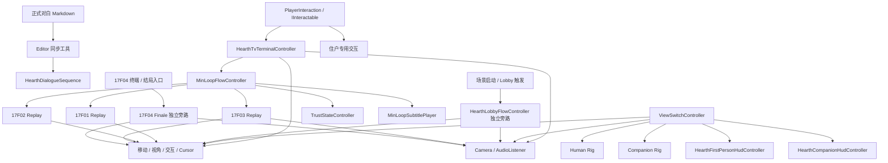
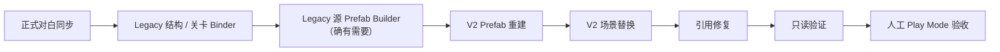
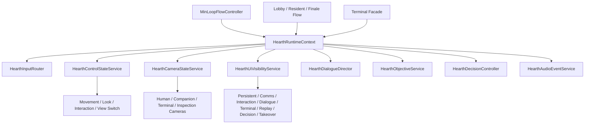

# HEARTH 下一阶段：UI 代码架构与重构路线图

> 日期：2026-07-25
> 实施状态更新：2026-07-26
> 目标：先弄清现有代码、场景和 UI 资产的执行关系，再安排后续实现，避免继续用局部修补解决全局状态竞争。
> 配套阅读：
>
> - `脚本使用说明总表.md`：每个脚本的挂载、Inspector 字段和使用方式。
> - `HEARTH_脚本审计与优化整合方案.md`：2026-07-05 的住户流程、数据化和 Timeline 方向。
> - `HEARTH_前序会话完整复盘与续做基线.md`：前序长会话的完整时间线、决策、历史完成陈述和当前续做基线。
> - `HEARTH_下一阶段_UI交互改造_00_阅读入口.md` 至 `06_待确认问题.md`：UI 内容与体验目标。

## 1. 架构结论

当前项目已经有明确的功能模块，但缺少“运行状态的唯一所有者”。

真正造成 UI、相机和控制反复异常的是：

- 相机由多个脚本直接启停。
- 玩家移动、视角、交互和模式切换由多个脚本分别锁定。
- Human HUD、Companion HUD、Lobby HUD 和终端 UI 由多个脚本分别显隐。
- 各脚本通过保存旧 bool 再恢复的方式管理状态，快照之间会互相覆盖。
- 编辑器 Builder 同时负责视觉生成、功能迁移、场景替换、引用修复、验证和保存。
- 场景中又存在重复控制器、错误相机引用和大量 Prefab Override。

所以，下一阶段的目标不应是一次性重写全部代码，而是先建立统一状态服务和明确迁移边界，让现有公开方法继续可用，再逐步拆分巨型脚本。

## 2. 审计范围与规模

本次聚焦：

- `Assets/Scripts/` 下的 HEARTH 运行时代码。
- `Assets/Editor/` 下的 HEARTH Builder、Binder、同步和验证工具。
- `SampleScene` 中 Human、Companion、五台终端、玩家 Rig 和流程控制器。
- V2 Prefab、场景 Override 和生成图片。

当前自研运行时代码按目录大致分为：

| 目录 | 角色 |
|---|---|
| `Assets/Scripts/Audio` | 音频触发与状态 |
| `Assets/Scripts/Interactions` | 射线交互、可交互接口和通用交互 |
| `Assets/Scripts/MinLoop` | 总流程、住户回放、Lobby、结局、字幕、信任度 |
| `Assets/Scripts/UI/HearthHud` | Human HUD、Companion HUD、终端、提示与页面 |
| `Assets/Scripts/Environment` | 地点、城市和环境辅助 |
| `Assets/Editor` | 自动绑定、Prefab 构建、V2 切换、数据同步和验证 |

本次统计到：

- `Assets/Scripts` 中约 110 个自研运行时 C# 文件。
- `Assets/Scripts` 与 `Assets/Editor` 合计约 6.1 万行 C#。
- 运行时代码中约有 95 处 `FindObjectOfType`、`FindObjectsOfTypeAll` 或 `GameObject.Find` 类查找。
- MinLoop 与 HUD 范围内约有 31 个 `Update` / `LateUpdate`。
- 项目目前没有为自研模块建立 asmdef，也未发现覆盖这些状态组合的自动化测试。

规模最大的相关文件：

| 文件 | 约行数 | 当前承担职责 |
|---|---:|---|
| `HearthTvTerminalController.cs` | 2718 | 页面、输入、相机、控制锁、音频、剧情路由、HUD 显隐 |
| `HearthUiV2Builder.cs` | 1850 | 生成、迁移、替换、修复、预览、验证、保存 |
| `HearthCompanion17F03ReplayController.cs` | 1460 | 17F03 剧情、演员、交互、字幕、HUD、控制 |
| `HearthCompanion17F02ReplayController.cs` | 1417 | 17F02 剧情、演员、门、黑屏、字幕、HUD、控制 |
| `Hearth17F04FinaleController.cs` | 1053 | 结局流程、相机、控制、UI 和剧情 |
| `HearthFirstPersonHudController.cs` | 1051 | Human HUD 页面、弹窗、历史、设置与输入协调 |
| `HearthLobbyFlowController.cs` | 863 | Lobby 剧情、HUD、终端、相机和控制 |
| `HearthCompanion17F01ReplayController.cs` | 807 | 17F01 回放流程 |
| `MinLoopFlowController.cs` | 788 | 总状态、住户、信任度、处置和终端返回 |

这些数字不是“文件大就一定错误”，但说明相机、输入和 UI 的跨模块职责已经集中到少数巨型控制器中。

## 3. 当前系统结构



图中最需要注意的是：`Camera` 和 `Control` 都有多个入边。这表示它们没有唯一写入者。

## 4. 代码模块与连接关系

### 4.1 输入与交互层

主要脚本：

- `PlayerInteraction`
- `IInteractable`
- `HearthTvTerminalInteractable`
- `HearthCompanionReplayInteractable`
- 各住户专用交互脚本

正常职责应是：

```text
读取玩家交互输入
→ 射线找到 IInteractable
→ 调用 Interact
→ 由目标系统请求状态切换
```

当前问题：

- HUD、终端、ViewSwitch、住户控制器也各自在 `Update` 中读取按键。
- 同一个按键可能在同一帧被多个系统消费。
- 没有统一的 Input Context 判断“当前是 Gameplay、Terminal 还是 Dialogue”。

### 4.2 视角与玩家 Rig 层

主要脚本：

- `ViewSwitchController`
- `FirstPersonLook`
- 玩家移动脚本
- `PlayerInteraction`
- Human / Companion Camera 与 AudioListener

`ViewSwitchController` 当前负责：

- Human/Companion 根物体。
- 两套相机和 AudioListener。
- 移动、视角和交互组件。
- Human/Companion HUD。
- 在 `Update()` 中监听 `R`。

已有 `FindPreferredController()` 会优先选 `MIN_LOOP_ROOT/FlowManagers` 下的正式控制器，这比普通 `FindObjectOfType` 更可靠；但只有迁移到这个入口的脚本才能受益。

### 4.3 总流程层

主要脚本：

- `MinLoopFlowController`
- `TrustStateController`
- `MinLoopSubtitlePlayer`
- `HearthDialogueSequence`
- Stage Activator / Anchor / Cue / Audio / Lighting 相关脚本

`MinLoopFlowController` 是当前最接近“全局导演”的对象，负责：

- 当前住户和阶段。
- 终端发起回放。
- 回放完成。
- A/B 处置。
- 信任度。
- 返回终端或推进下一阶段。

它适合继续作为叙事流程状态源，但不应直接成为相机、输入和所有 UI 组件的写入者。它应发布“模式请求”和“剧情事件”，由专门服务决定最终表现。

### 4.4 住户和 Lobby 流程层

主要脚本：

- `HearthLobbyFlowController`
- `HearthCompanion17F01ReplayController`
- `HearthCompanion17F02ReplayController`
- `HearthCompanion17F03ReplayController`
- `Hearth17F04FinaleController`

当前每个住户脚本通常同时承担：

- 自己的剧情状态机。
- 演员显隐、站位、路径和门。
- 字幕和音效。
- 相机切换。
- 玩家移动和视角锁定。
- Human/Companion HUD 显隐。
- 与终端和总流程的衔接。

住户之间真正不同的应是剧情阶段、演员、锚点、对白和特殊演出；相机、输入、控制锁和 UI 互斥规则应抽成公共能力。

### 4.5 Human HUD

主要脚本：

- `HearthFirstPersonHudController`
- `HearthFirstPersonHudInput`
- `HearthFirstPersonHudFlowBinder`
- `HearthPlayerControlLock`
- `HearthDispositionHistoryView`
- `HearthSettingsView`
- `HearthLocationProbe` / `HearthLocationHudView`

当前 Human HUD 会处理：

- Tab 页面。
- Today、History、Settings。
- 警告、信任度、结局和提示。
- 打开页面时锁玩家。
- 与总流程和地点系统同步。

当前现场的页面序列化数组不完整，控制器通过运行时查找子页面进行补救。后续应让 Prefab 自身可验证，而不是把“运行时找得到”当作最终完成。

### 4.6 Companion HUD

主要脚本：

- `HearthCompanionHudController`
- `HearthCompanionHudFlowBinder`
- `HearthCompanionHudExclusiveMode`
- `HearthCompanionHudLayoutController`
- Decision / DataStream / TriggerCard / HoldPrompt / Effects 等 View
- `HearthCompanionHudSceneData`

当前通过 Scene Data 驱动不同陪伴单元页面，这一方向可以保留。

需要复核的缺口：

- 现场 `statusPanelView` 为空。
- `ApplyScene()` 中状态面板存在先 `Clear()`、但未明显调用对应 `Apply(scene)` 的可疑路径。
- `FlowBinder`、`ExclusiveMode` 和 Controller 自身都可能在 `LateUpdate` 中调整显隐。

### 4.7 终端 UI

主要脚本：

- `HearthTvTerminalController`
- `HearthTvTerminalInteractable`
- `HearthTerminalCameraTransition`
- `HearthTerminalBootSequence`
- `HearthTerminalSelectionHighlighter`
- `HearthHudPage`
- `HearthHudButtonAction`

`HearthTvTerminalController` 当前同时负责：

1. 页面数组和页面导航。
2. 键盘输入和焦点。
3. 打开、关闭和即时关闭。
4. 固定终端相机和相机过渡。
5. Cursor 锁定。
6. 玩家控制锁定。
7. 第一人称 UI 隐藏和恢复。
8. 音频和开机动画。
9. 回放请求、A/B 和自定义动作。
10. 与 `MinLoopFlowController` 的连接。

它已经是当前 UI 状态冲突的中心节点，后续应先保留公开 API，再从内部拆分职责。

### 4.8 Editor 工具链

主要工具：

- Human / Companion HUD Builder。
- TV Terminal Prefab Builder。
- 各住户 Minimal Loop Binder。
- Final Dialogue Sync。
- V2 Builder。
- 场景验证器。

这些工具目前没有明确分成：

- 内容同步。
- 结构生成。
- 场景迁移。
- 引用修复。
- 只读验证。

尤其 `HearthUiV2Builder` 一次操作会修改大量对象并自动保存场景，不适合继续作为频繁视觉调整入口。

### 4.9 当前 UI 资产生产链

```text
Human：
Layout JSON → Human Builder → Legacy Root → V2 Builder → V2 Root → Scene

Companion：
14 个 Scene Data + Layout SO → Legacy Companion → V2 Builder → V2 Companion → Scene

17F01/02/03 Terminal：
PPT → 24 张整页 PNG → 页面 Prefab → Legacy Terminal → V2 Overlay → Scene

17F04 / Lobby Terminal：
住户 Binder → Legacy Terminal → V2 Builder → Scene
```

当前 25 张 GeneratedParts 只有 14 张进入 V2 引用，11 张尚未接入。项目没有 V2 专用 Theme SO、字体、Material 或 SpriteAtlas；约 595 个 TMP 仍使用 `LiberationSans SDF`。

这说明当前视觉系统还没有形成真正的设计 Token 和资源边界。

## 5. 当前编辑器侧执行顺序

如果必须使用现有工具，安全顺序是：



重要限制：

- 不要在 V2 场景替换之后再次运行会重建旧终端的 Binder。
- 例如 17F04 Binder 会调用旧终端 Builder 的 `StandardizeTvTerminal`；如果顺序错误，会把 V2 再替换成旧终端。
- 当前 V2 切换会自动保存所有打开场景，执行前必须先固定 Git/备份基线。

## 6. 当前运行时执行顺序

### 6.1 启动阶段

1. 各控制器在 `Awake` 自行查找引用。
2. ViewSwitch 应用 Human/Companion 初始模式。
3. Human/Companion HUD 初始化页面和显隐。
4. `Start` 阶段由总流程和 Lobby 初始化剧情状态。
5. 多个 `Update/LateUpdate` 开始持续读取输入和重写状态。

由于场景中存在重复 Rig 和多个 ViewSwitch，Awake 阶段的普通自动查找已经具有不确定性。

### 6.2 打开终端

当前大致顺序：

```text
PlayerInteraction.Interact
→ HearthTvTerminalInteractable.Interact
→ HearthTvTerminalController.OpenTerminal
→ EnsureReferences
→ 显示 Canvas / Content
→ SetGameplayLocked(true)
→ SuppressFirstPersonUi
→ 解锁并显示 Cursor
→ 选择初始页面 / 播放启动音效与动画
→ 切到终端相机
→ 允许终端输入
→ 触发 OnOpened
```

问题：

- `SetGameplayLocked(true)` 只会关闭数组里配置的 Behaviour；5 个 V2 Prefab 的数组均为空，场景仅见一个 size=3 Override，未见有效元素引用。
- `SuppressFirstPersonUi` 自己保存 Canvas 状态。
- Lobby、Companion ExclusiveMode 和住户脚本也会保存或重写同一批状态。
- `ViewSwitchController.Update()` 存在无全局门禁的 R 输入路径，是否在每个剧情阶段生效尚待 Play Mode 验证。

### 6.3 终端发起剧情

```text
17F01–03：
Terminal Action
→ MinLoopFlowController
→ 对应 17F01 / 17F02 / 17F03 Controller
→ 住户脚本自行管理相机、控制、演员、字幕和 HUD
→ 回放完成
→ MinLoopFlowController
→ 返回终端或进入 Decision

Lobby：
Scene / Lobby Trigger
→ HearthLobbyFlowController
→ 大厅对白、任务终端、电梯与 HUD

17F04：
17F04 Terminal / Finale Trigger
→ Hearth17F04FinaleController
→ 结局相机、控制、照片、选择与 HUD
```

如果终端、住户和 ViewSwitch 都认为自己拥有相机，就可能在交接帧互相抢占。

### 6.4 关闭终端

当前大致顺序：

```text
关闭输入
→ 播放关闭动画和音效
→ 切回玩家相机
→ 恢复 Cursor
→ SetGameplayLocked(false)
→ RestoreFirstPersonUi
→ 隐藏终端 Canvas
→ 触发 OnClosed
```

根本问题在于“恢复”：

- 终端只知道自己打开时保存的值。
- 终端打开期间，其他系统可能已经合法改变了目标状态。
- 终端恢复旧值后，其他脚本又可能在下一帧再次覆盖。

`OnDisable()` 目前只确保恢复第一人称 UI，并没有统一恢复相机、玩家控制和 Cursor。对象在打开过程中被禁用或场景切换时，可能留下半恢复状态。

## 7. 同一状态的多个写入者

| 状态 | 当前主要写入者 | 风险 |
|---|---|---|
| Human / Companion Camera | ViewSwitch、Terminal、Lobby、F03、F04、CameraTransition | 多个 Camera 同时开或正确相机被抢走 |
| AudioListener | ViewSwitch、Terminal、F03、F04 | 0 个或多个 Listener |
| 玩家移动 | ViewSwitch、Terminal、HUD ControlLock、住户脚本、Finale | 恢复顺序错误或剧情中可移动 |
| 玩家视角 | ViewSwitch、Terminal、正式对白、住户脚本 | 终端/对白中仍可转头 |
| PlayerInteraction | ViewSwitch、Terminal、住户流程 | 交互提前恢复或永久关闭 |
| R 视角切换 | ViewSwitch.Update | 终端和剧情期间绕过流程 |
| Cursor | Terminal、菜单、暂停/结局 | 锁定状态与 UI 不一致 |
| Human HUD | ViewSwitch、Terminal、Companion ExclusiveMode、Lobby、F03 | 叠加、消失或错误恢复 |
| Companion HUD | ViewSwitch、Companion Controller、FlowBinder、ExclusiveMode、Replay | 多个 LateUpdate 反复改显隐 |
| Lobby Narrative Canvas | Lobby、Terminal 的全局 UI 抑制 | 终端退出后永久不显示 |

只要这个表中每一行仍有多个直接写入者，局部修复就可能被下一条流程重新破坏。

## 8. 已确认的现场问题

> 本节记录的是 2026-07-25 的修复前审计证据。P0-1、P0-2 和 P0-3 已在
> 2026-07-26 完成第一轮修复并通过本轮指定的静态与 Play Mode 检查；
> P0-4 及 P1 各项仍是后续架构治理问题。最新状态见第 11、12、15 节。

### P0-1：17F02 和 17F04 终端相机错误

实时 Unity MCP 和 Scene YAML 均确认：

- 17F02 的 `worldCamera`、`terminalCamera` 指向 Human `First Person Camera`。
- 17F04 也是同样情况。
- 两个 TV 层级中都有自己的 Camera，却没有被绑定。

代码原因：

- `EnsureReferences()` 在 `terminalCamera` 为空时直接把 `worldCamera` 当成终端相机。
- V2 Builder 的 `RepairTerminalCameraBinding()` 只修复空引用。
- 错误但非空的引用会绕过修复和验证。

后续必须拆开三个概念：

- `playerViewCamera`
- `terminalViewCamera`
- `uiEventCamera` / `Canvas.worldCamera`

三者禁止复用一个含义模糊的 `worldCamera` 字段。

### P0-2：场景中有 3 个 `ViewSwitchController`

正式对象应是：

`MIN_LOOP_ROOT/FlowManagers/ViewSwitchController`

另外两个位于一楼旧层级，其中一个引用完整，另一个关键 Rig 引用为空。

`HearthLocationProbe` 的序列化引用还指向一个旧重复控制器。它只在字段为 Null 时重新查找，因此错误但非空的旧引用不会自行修复。

### P0-3：终端控制锁不完整

五个 V2 Prefab 的 `gameplayBehavioursToDisable` 均为空；场景仅见一个 size=3 Override，未见有效元素引用。当前主要依赖关闭 `PlayerInteraction`，完整锁定效果尚未经过本轮 Play Mode 验证。

验收上不能再用“按 E 不会交互”替代“玩家已被锁定”。需要分别验证：

- 移动。
- 转头。
- 跳跃/蹲伏。
- 交互。
- R 切换。
- Tab / Esc / Space 等 UI 输入上下文。

### P0-4：UI 快照冲突

已确认的典型路径：

```text
Lobby 保存并隐藏自己的 Canvas
→ Terminal 再保存当前 Canvas 状态
→ Terminal 关闭并恢复自己的快照
→ Lobby 下一帧根据自己的状态再次覆盖
```

任何基于“进入前 bool 快照”的局部修复都不能彻底解决这个问题。

### P1-1：V2 视觉来源不唯一

当前视觉状态分散在：

1. Legacy Prefab。
2. `HearthUiV2Builder` 中的硬编码样式。
3. `GeneratedParts` PNG。
4. V2 Prefab。
5. Scene Prefab Override。

而 V2 使用说明又允许直接修改 V2 Prefab；下一次“Rebuild All V2 UI Assets”可能把手工修改重新覆盖。

必须选定一个唯一来源。

### P1-2：迁移复制范围错误

`CopyMonoBehaviourState()` 会遍历旧根下几乎全部 MonoBehaviour，并通过 JSON 覆盖新根。

这不仅会复制功能控制器，还会复制：

- TMP 字体、字号、颜色、换行和 Overflow。
- Image 颜色和 enabled。
- Canvas 与 CanvasGroup 状态。
- 其他视觉组件的旧实例值。

场景 Human V2 根出现约 1400 级别 Override、Companion 根约 200 级别 Override，是这个策略的直接警报。

精确审计结果：

- Human V2：1435 个 Override。
- Companion V2：200 个 Override。
- Human 中至少有 158 组字体颜色、161 个换行、160 个 Overflow、79 个字号和 63 个 Image enabled Override。

### P1-3：验证器会产生假安全感

现有验证器没有检查：

- 是否只有一个正式 ViewSwitch。
- 是否只有一套正式 Human/Companion Rig。
- 终端相机是否属于自身 TV。
- 终端相机是否等于玩家相机。
- 页面、焦点和状态面板引用是否完整。
- 玩家控制锁是否有效。
- 任意时刻是否只有一个 Camera/AudioListener。
- 五台终端的真实打开、关闭和中断流程。
- V2 Theme 与视觉 Override 是否符合规则。

此外，`EnsureV2AssetsExist` 只预检 Human、Companion 和 17F01；其余四个 V2 终端缺失时仍可能继续切换，形成混合场景。

### P1-4：运行时自修复掩盖 Prefab 缺陷

Human HUD 和 Terminal 会在运行时重新寻找页面；Companion 和其他脚本也会自动找控制器。

自修复可以作为最后保险，但不能替代：

- Prefab 引用完整性。
- Scene Context 明确绑定。
- EditMode 验证。

### P1-5：名称与层级路径仍是隐藏 API

V2 Builder 的终端类型判断依赖：

- 对象路径名。
- `residentId`。
- 找不到时回退到 17F01。

对象迁移又依赖完整 Transform 路径和“同类型组件的序号”。一旦出现重命名、同名兄弟或组件顺序变化，映射就会静默遗漏或选错。

后续应使用显式 `UiSlotIdentity` / `TerminalIdentity` 和 `HearthUiPrefabSet`，不要让名称继续承担类型系统职责。

### P1-6：旧页面仍挂在 V2 下方

三个 V2 家庭终端仍嵌套旧 `TerminalImagePages`。旧 Graphic 只是 Alpha 为 0，组件仍然 Enabled；V2 内容依靠更高 Canvas 排序盖在上方。

结果是：

- 旧 24 张整页 PNG 和旧页面层级仍在运行结构中。
- V2 仍受旧 8 页导航约束。
- 页面重复、占位照片和通用文本没有真正数据化。

Human Builder 另有 22 个独立页面 Prefab，但 Human Root 对它们没有引用；修改这些资产不会改变正式 Root。

## 9. 目标架构

### 9.1 统一运行上下文



`HearthRuntimeContext` 应在场景中明确序列化：

- 唯一正式 ViewSwitch。
- Human Rig 与 Companion Rig。
- Human HUD 与 Companion HUD。
- 字幕、总流程、信任度和 Objective。
- Camera、Control、Input、UI 四个统一服务。

它不应通过名字猜测全场景对象。

### 9.2 输入路由

建议输入上下文：

| Context | 允许输入 |
|---|---|
| `Gameplay` | 移动、转头、E、R、Tab |
| `Terminal` | 页面导航、Space、Esc；禁止移动、转头、R |
| `FormalDialogue` | Space/跳过规则、Esc 规则；禁止普通交互 |
| `Replay` | 按阶段开放移动、转头、E/Hold E |
| `Inspection` | 检查专用输入；禁止 R |
| `FinalChoice` | 方向、Space；禁止普通交互 |
| `Pause` | 暂停菜单；屏蔽其他上下文 |

输入只由 `HearthInputRouter` 判断当前 Context，再把动作事件发给对应系统。

### 9.3 带 Owner 的控制租约

不要再保存和恢复零散 bool，改为带所有者的租约/token：

```text
terminalLease = ControlState.Acquire(
    owner: terminal,
    blockMovement: true,
    blockLook: true,
    blockInteraction: true,
    blockViewSwitch: true)

terminalLease.Dispose()
```

最终状态由当前所有有效租约共同计算：

- 只要任一租约阻止 Movement，Movement 就保持关闭。
- 只有所有阻止 Interaction 的租约都释放，Interaction 才恢复。
- 对象 `OnDisable` 或流程取消时释放自己的租约，不覆盖其他系统。

这样可以解决 Terminal、Lobby、Dialogue 和 Finale 嵌套时的恢复冲突。

### 9.4 相机状态服务

相机和 AudioListener 只能由 `HearthCameraStateService` 写入。

建议相机模式：

- Human。
- Companion。
- Terminal。
- ReplayFixed。
- Inspection。
- Cutscene。
- Finale。

所有流程脚本只能请求：

```text
PushCamera(owner, mode, targetCamera, transition)
PopCamera(owner)
```

服务负责：

- 确保只有一个主 Camera。
- 确保只有一个 AudioListener。
- 决定回退到哪个上一层相机。
- 处理中断、禁用和场景卸载。

### 9.5 UI 可见性服务

UI 不再由各流程直接 `SetActive` 或修改 Canvas。

建议层：

- PersistentHud。
- Comms。
- Interaction。
- FormalDialogue。
- Terminal。
- Replay。
- Decision。
- Takeover。

流程只提交模式和局部请求；`HearthUiVisibilityService` 根据规则计算：

- Human/Companion 互斥。
- Terminal 是否隐藏全部第一人称 UI。
- Replay 是否显示 Companion HUD。
- FormalDialogue 与普通交互提示互斥。
- Takeover 是否接管整屏。

### 9.6 终端拆分

保留 `HearthTvTerminalController` 作为兼容 Facade，先不破坏现有 Binder 和剧情调用。

内部逐步拆成：

| 新模块 | 职责 |
|---|---|
| `TerminalSessionController` | Open/Close 生命周期与状态 |
| `TerminalPageNavigator` | 页面、焦点和按键导航 |
| `TerminalInputAdapter` | 接收 InputRouter 动作 |
| `TerminalCameraBinding` | 明确绑定玩家、终端和 UI 相机 |
| `TerminalActionRouter` | Replay、Enter Unit、自定义动作 |
| `TerminalAudioPresenter` | 开机、关闭、翻页和循环音 |
| `TerminalView` | Canvas、页面和视觉展示 |
| `HearthTerminalConfig` | 每户页面、文案、操作、音频和相机配置 |

原有公开方法如 `OpenTerminal`、`CloseTerminal`、`ShowPage` 暂时委托给新模块，以便渐进迁移。

### 9.7 稳定场景 Wrapper

为了避免每次换皮都销毁整个功能根物体，建议每个 UI 槽位保留稳定 Wrapper：

```text
TerminalSlot_17F01
├─ TerminalIdentity
├─ Interactable
├─ TerminalSessionController
├─ Scene References
├─ Terminal Camera Binding
└─ VisualRoot
   └─ Legacy 或 V2 视觉 Prefab
```

相机、剧情、交互和场景引用留在 Wrapper；Legacy/V2 只替换 `VisualRoot`。

Human 与 Companion 也使用相同模式：

- 稳定功能根不销毁。
- 视觉子树可以替换。
- 不再需要遍历全场景重映射所有 MonoBehaviour。
- 切换主题不再影响剧情引用。

### 9.8 住户控制器拆分

保留每户自己的剧情状态机，但抽出公共能力：

- `ReplayContext`
- `DialogueRunner`
- `ActorStageDirector`
- `InteractionGate`
- `TransitionRunner`
- `ResidentReplayConfig`

特殊剧情继续留在住户薄壳中；通用的相机、输入、HUD、字幕等待和返回终端逻辑不再复制。

复杂固定演出逐步使用 Timeline，不在一个协程中同时硬编码演员移动、门、音效、黑屏和字幕时间。

## 10. V2 资产的唯一来源方案

推荐采用：

```text
V2 Base Prefab / Prefab Variant
+ Theme / Layout ScriptableObject
+ GeneratedParts 图片
= 正式来源
```

具体规则：

1. Legacy 只用于回退和迁移参考，不再是 V2 的日常生成源。
2. Human、Companion、Terminal Base 是正式结构。
3. 五台终端使用 Prefab Variant 或 Config 表达差异。
4. Theme 和 Layout 资产保存颜色、字号、边距和公共布局。
5. Builder 拆为：
   - 一次性 Migration。
   - 可重复且不破坏手工内容的 Asset Import。
   - 只读 Validator。
6. 禁止把 Graphic、TMP、Canvas 和 Layout 类组件从 Legacy 全量复制到 V2。
7. 若确需迁移，只允许白名单字段：
   - 剧情控制器引用。
   - Dialogue / Scene Data 资产。
   - 音频。
   - 明确列出的功能配置。
   - 经过逐项审计的动作绑定。
8. 不通过通用 JSON 复制 UnityEvent；需要的事件在稳定 Wrapper、Prefab 或明确迁移代码中重新绑定。
9. 场景中 V2 Prefab 的视觉 Override 应接近零；场景只允许保存位置、终端相机等场景专属引用。

## 11. 分阶段重构路线

### 阶段 0：冻结并验证当前基线（部分完成）

目标：不重构功能，先让现场可解释。

任务：

- 备份当前 Dirty Scene 和未跟踪 V2 资产。
- 将 28 张截图标为 DebugHistory，选定后续 AcceptanceBaseline 规则。
- 输出场景拓扑清单。
- 扩展只读 Validator。
- 暂停运行 V2 重建、V2/Legacy 切换和会覆盖终端的 Binder。

验收：

- 每个场景对象的正式/参考/旧版身份可解释。
- 能明确指出每台终端、每套 HUD、每个 Rig 和控制器的唯一正式实例。

2026-07-26 状态：

- 已输出并验证当前运行拓扑，新增只读 Runtime Topology Validator。
- 已暂停本轮 V2 重建和大范围场景切换。
- Dirty Scene、未跟踪 V2 资产、历史截图仍未形成正式 Git/AcceptanceBaseline，
  因此“基线归档”仍未完成。

### 阶段 1：修复 P0 引用和重复对象（本轮已完成）

任务：

- 只保留一个正式启用的 `ViewSwitchController`。
- 让所有引用指向 `MIN_LOOP_ROOT/FlowManagers/ViewSwitchController`。
- 修复 `HearthLocationProbe`。
- 修复 17F02、17F04 的 Terminal Camera。
- 明确禁用或移出运行层级的参考 Rig。
- 验证 Camera 和 AudioListener 唯一性。

验收：

- 五台终端的终端相机都属于自身 TV 层级。
- 任一终端相机不等于 Human/Companion 玩家相机。
- 运行时只有一个有效 Camera 和 AudioListener。
- 普通自动查找不会命中参考 Rig 或旧控制器。

2026-07-26 状态：

- 场景中仅保留 `MIN_LOOP_ROOT/FlowManagers/ViewSwitchController`。
- `HearthLocationProbe`、运行时流程和相关 Binder 改用当前 Scene 的首选正式控制器。
- Lobby、17F01、17F02、17F03、17F04 五台终端均绑定到各自 TV 硬件层级内的 Camera。
- 五台终端打开、稳定、关闭时均检查到一个有效 Camera 和一个有效 AudioListener。
- 17F01 组件中途停用时完成即时清理并恢复 Human Camera、Listener 和玩家控制。

### 阶段 2：建立四个统一状态服务（Owner Control Lease 已先行）

顺序：

1. `HearthInputRouter`
2. `HearthControlStateService`
3. `HearthCameraStateService`
4. `HearthUiVisibilityService`

先让 ViewSwitch、Terminal 和 Lobby 接入；保留旧公开方法作为适配器。

验收：

- Terminal 打开后移动、转头、交互和 R 全部被阻断。
- Terminal 关闭后只释放自己的锁。
- Lobby + Terminal 嵌套时 HUD 不会错误恢复。
- 对象中途禁用后不会残留 Cursor、Camera 或控制锁。

2026-07-26 状态：

- `HearthPlayerControlLock` 已改为按 Owner 申请/释放；第一个 Owner 保存状态，
  最后一个 Owner 释放后才恢复，销毁或停用 Owner 会清理。
- `ViewSwitchController` 已支持按 Owner 阻断手动 `R`，并把共享控制锁作为全局门禁。
- `HearthTvTerminalController` 已接入 Owner 控制锁、单终端会话登记和 `OnDisable` 清理。
- 两个 Owner 嵌套锁的 1 → 2 → 1 → 0 流程已在 Play Mode 检查通过。
- 完整 `InputRouter`、Camera、UI Visibility、Cursor 和 Narrative Context 服务尚未建立，
  不能把这一步标记为整个阶段 2 已完成。

### 阶段 3：拆分终端控制器

任务：

- 建立 Terminal Config。
- 拆页面、输入、相机、动作和音频模块。
- 将五台终端迁到同一生命周期。
- 删除 `worldCamera` 与 `terminalCamera` 的语义混用。
- 将终端内容压缩到每户 1–2 页。
- 将最终 A/B 移到独立 Decision Layer。
- 将旧 24 张整页 PNG 和隐藏 Graphic 移出正式运行链。

验收：

- 同一组测试可对五台终端参数化执行。
- 每台终端只通过配置表达内容差异。
- 不再需要每台终端自己的状态修复分支。

### 阶段 4：收口 V2 资产管线（迁移边界已修，视觉来源未收口）

任务：

- 将 V2 Prefab / Variant 设为正式源。
- 把 Legacy → V2 全量 JSON 复制改为一次性、白名单迁移。
- 拆分 Builder、Migration、Binder、Validator。
- 移除自动保存或增加明确预览与确认步骤。
- 清理 Human/Companion 场景视觉 Override。
- 建立 `HearthUiTheme`、`HearthUiLayout`、`HearthUiPrefabSet`。
- 建立字体、Material、SpriteAtlas 与透明图导入规则。
- 让 Human 页面真正使用 Nested Prefab，或删除未被 Root 引用的重复页面资产。

2026-07-26 状态：

- `HearthUiV2Builder` 已要求七个 V2 Prefab 全部存在，并在场景修改前严格预检
  一个 Human、一个 Companion 和五个唯一终端槽位。
- 场景迁移已从“遍历全部 MonoBehaviour”改为根控制器功能字段白名单；
  只单独保留 Lobby 两个必要回调和 17F04 Home 一个必要回调。
- Validator 已加入唯一 ViewSwitch、七个槽位、页面引用、五台终端本地相机归属和必要回调检查。
- 本轮没有运行 V2 重建，也没有清除 Scene Prefab Override；已在 `SampleScene`
  隔离副本完成 V2/Legacy 双向切换、Undo/Redo 和保存重载验证。
- Human 约 1435、Companion 约 200、七个 V2 实例合计约 2023 个 Override 仍是明确债务。
- Companion V2 Prefab 的 `statusPanelView` 当前仍为空；控制器内部 `Apply(scene)` 修正
  尚未形成可见状态面板验收。
- Lobby `activeLoopCuePlayer` 已在切换和重载后保持指向 `StorySFX_Lobby`；
  `AssignmentTerminal.Hum` 的正式 AudioClip 仍待绑定。

验收：

- 重开 Unity 后 V2 视觉不变化。
- 运行 Binder 不会把 V2 换回 Legacy。
- 场景中不保存字号、颜色、换行等大批视觉 Override。
- 修改 Theme/Layout 后，预期范围内的 UI 稳定更新。

### 阶段 5：17F01 垂直切片

完整跑通：

```text
Human 探索
→ 打开 17F01 Terminal
→ 进入 Companion Replay
→ 完成关键交互
→ 独立 Decision
→ Trust / Field Unit Feedback
→ 返回正确玩家视角与 HUD
```

同时测试：

- 正常关闭。
- Esc 关闭。
- 中途禁用。
- 进入时按 R、Tab、E。
- 从 Human 与 Companion 两种入口打开。
- 有/无语音。
- 低帧率和转场中重复输入。

17F01 通过后，再依次迁移 Lobby、17F02、17F03、17F04。

### 阶段 6：住户流程和工程边界

任务：

- 引入 `ResidentReplayConfig`。
- 提取公共 Replay 能力。
- 将复杂固定演出迁到 Timeline。
- 为 Core、UI、Replay、Editor 建立 asmdef。
- 建立 EditMode 和 PlayMode 测试程序集。
- 最后归档 Legacy 工具和不再使用的旧脚本。

## 12. 新验证器必须覆盖的规则

2026-07-26 已实现并通过的静态覆盖：

- 一个 Human、一个 Companion、五台唯一终端。
- 一个且仅一个正式 `ViewSwitchController`。
- `HearthLocationProbe` 指向正式 ViewSwitch。
- Human 与终端页面引用完整、唯一并位于各自根节点下。
- 五台 Terminal Camera 位于自身 TV 硬件层级，不是 Human/Companion 玩家相机。
- 五台终端绑定共享 `HearthPlayerControlLock`，转场启用 AudioListener 连续性。
- Lobby 和 17F04 Home 的三个必要剧情回调。
- V2/Legacy Marker 与七个槽位的混合状态检查。

仍未实现为自动 Validator/Test 的项目包括：正式 Human/Companion Rig 唯一性、Missing Script 全项目扫描、
视觉 Override 白名单、Focus/StatusPanel/Flow/Audio 全配置检查，以及 Play Mode 的剧情入口参数化覆盖。

### 静态场景验证

- 恰好一个正式 Human HUD。
- 恰好一个正式 Companion HUD。
- 恰好五台预期终端。
- 恰好一个正式启用的 ViewSwitch。
- 恰好一套正式 Human Rig 和 Companion Rig。
- 所有流程引用指向正式 ViewSwitch。
- 每台 Terminal Camera 位于自己的 TV 层级。
- Terminal Camera 不等于玩家相机。
- 页面、Focus、StatusPanel、Flow、Audio 引用符合配置。
- V2 Marker 和 Prefab 类型匹配。
- 不存在 Missing Script。
- 不存在超出白名单的视觉 Scene Override。

### Play Mode 验证

- 任意时刻只有一个有效 Camera。
- 任意时刻只有一个有效 AudioListener。
- Terminal 模式中 Movement、Look、Interaction、R 被阻断。
- Human/Companion/Terminal HUD 互斥正确。
- Open、Close、Instant Close、OnDisable、场景切换都能释放自己的租约。
- Formal Dialogue、Replay、Decision 和 Takeover 不发生输入穿透。
- 五台终端分别从 Human/Companion 入口完成相同测试。

### 视觉基线

统一：

- Unity 版本。
- 场景提交。
- 分辨率和画质。
- 测试步骤。
- 字体和语言。
- 截图命名。

建议每个正式状态只保留一张基线图和必要的差异图，不再用 `Final2`、`Fixed_Late` 表达版本关系。

## 13. 状态转换验收矩阵

| From | To | 相机 | Human HUD | Companion HUD | 控制 | 关键验收 |
|---|---|---|---|---|---|---|
| Human Gameplay | Human Tab | Human | 菜单 | 隐藏 | 锁移动/视角 | Esc 后恢复 |
| Human Gameplay | Terminal | TV Camera | 全隐藏 | 全隐藏 | 全锁，允许终端输入 | R 不生效 |
| Companion Gameplay | Terminal | TV Camera | 全隐藏 | 全隐藏 | 全锁，允许终端输入 | 关闭回 Companion |
| Terminal | Replay | Replay/Companion | 隐藏 | 按剧情 | 由 Replay Context 决定 | 不闪回玩家相机 |
| Replay | Decision | Decision Camera/当前固定视角 | 隐藏 | 隐藏或低亮 | 只允许选择 | 只结算一次 |
| Decision | Human Gameplay | Human | 恢复 | 隐藏 | 恢复 Gameplay | Trust 与历史同步 |
| Any | Formal Dialogue | 当前或指定 | 按规则降噪 | 按规则 | 禁止普通交互 | Space 只推进对白 |
| Any | Takeover/Finale | Finale | 隐藏 | 隐藏 | 全锁 | 中断后状态明确 |

## 14. 后续开发规则

在结构治理完成前：

- 不继续批量生成新的 V2 全屏图。
- 不运行会自动保存场景的大范围切换。
- 不在多个流程脚本中新增新的 Camera/Canvas 直接写入。
- 不通过新增更多 Null 自修复掩盖错误引用。
- 不复制新的住户巨型控制器。
- 不以一张截图或 Validator 的“数量通过”代替流程验收。

任何新增 UI 功能都必须先回答：

1. 它属于哪个 UI Layer？
2. 谁是这个状态的唯一所有者？
3. 它使用哪个 Input Context？
4. 它是否需要 Control Lease？
5. 它请求哪一种 Camera Mode？
6. 中途禁用、Esc、场景切换时如何释放？
7. 它的视觉真实来源是 Prefab、Theme、Layout 还是数据资产？

## 15. 2026-07-26 实施结果与下一项实际任务

原先推荐的“阶段 0 + 阶段 1”代码任务已直接执行。

实际结果：

| 验证项 | 结果 | 边界 |
|---|---|---|
| Unity 编译 | 本轮代码无新增编译错误 | 旧第三方警告仍存在 |
| Runtime Topology Validator | 通过 | 静态场景规则，不替代 Play Mode |
| V2 Open Scene Validator | 通过 | 不检查全部视觉 Override |
| Legacy/V2 双向切换 | 隔离场景通过 | 七个 UI 根整体替换，不代表视觉已逐像素定稿 |
| Undo / Redo | 隔离场景通过 | 单次切换可整体撤销并重做；共享父节点根的兄弟顺序也保持 |
| 保存后重载 | 隔离场景通过 | V2 标记、页面、回调、相机与锁引用保持 |
| Lobby Active Loop | 播放路由持久化 | `activeLoopCuePlayer` 正确；Cue 的正式 AudioClip 仍 TBD |
| 五台终端打开/关闭 | Lobby、17F01、17F02、17F03、17F04 均通过 | 基础会话，不是完整剧情链 |
| Camera / AudioListener | 进入、稳定、退出检查为各 1 个 | 已执行状态范围内 |
| 控制与 `R` | 终端中锁定，退出后恢复 | 未覆盖所有剧情/对话上下文 |
| 17F01 中途停用 | 清理并恢复通过 | 其余终端未逐台重复中断测试 |
| 双 Owner 控制锁 | 1 → 2 → 1 → 0 通过 | 手工 Play Mode 检查 |

下一项任务建议按下面顺序进行，仍然不要同时重建视觉：

1. 把当前 P0 场景、Prefab 和脚本形成可回退的版本基线，区分前序未提交修改。
2. 为现有 Owner Control Lock 建立最小 EditMode/PlayMode 测试程序集。
3. 以 `Lobby → 17F01 Terminal → Replay → Decision → Result → Return` 做第一条完整垂直切片。
4. 在垂直切片中再抽取 Camera、UI Visibility、Cursor 和 Narrative Input Context，
   不先创建无人接入的空服务。
5. 单独制定 V2 Override 清理方案，先解决 Companion `statusPanelView` 和视觉正式源，
   再决定是否运行 Rebuild 或重新切换场景。

本轮代码改动的挂载、Inspector 字段、公开接口和最小测试已同步写入
`脚本使用说明总表.md`；本文件不替代该脚本级说明。
