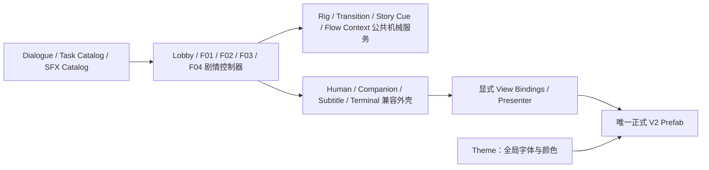

# HEARTH 全项目保守重构基线与 Legacy 清理表

更新日期：2026-08-08

本文件记录本轮“保持现有流程不变、逐步消除重复来源”的结构基线。它不是剧情策划案，也不授权删除当前仍被场景引用的旧组件。

## 1. 本轮不可改变的运行基线

- 启动点仍为一楼大堂，不恢复宣传片或序章。
- 正式流程仍为：Lobby → 任务终端 → 电梯 → 17F01 → 17F02 → 17F03 → 17F04 → 两条结局。
- Field Unit、场景角色和真实交流中的 Mia 仍按现有 `Space` 策略；自然独白与完全黑幕结局仍自动推进。
- 普通交互仍为短按 E；只有剧情指定的持续操作使用 Hold E；普通木门不能由玩家 E 直接开关。
- 正式英文对白、Dialogue Line ID、语音绑定、任务枚举、住户顺序、信任条件和 36 个正式 SFX 素材名称/GUID 均不改。
- `SampleScene.unity` 的现有未提交修改属于用户成果。本轮工具不自动保存场景，也不重建整个 SampleScene。

## 2. 重构后的权威链路

剧情控制器仍决定“何时发生什么”；公共服务只执行移动、淡入淡出和 Cue 播放。UI Controller 只改文字、显隐和交互状态，不再决定正式静态排版。

## 3. 正式可编辑来源

| 系统 | 唯一主要入口 | 运行时只允许修改 |
|---|---|---|
| Human HUD、Tab、Current Task、Final/Shutdown | `Assets/Prefabs/UI/HearthHud/V2/HearthHudRoot_V2.prefab` | 文字、页面显隐、选择高亮显隐 |
| Companion HUD、E/Hold E | `Assets/Prefabs/UI/HearthHud/V2/Companion/HearthCompanionHudRoot_V2.prefab` | 文字、状态、进度和显隐 |
| 正式/自然/黑幕字幕 | `Assets/Prefabs/UI/HearthSubtitle/V2/HearthSubtitleVisualCanvas_V2.prefab` | 当前说话内容、推进提示显隐、场景卡状态 |
| Lobby + F01–F04 终端 | `Assets/Prefabs/UI/HearthHud/V2/Terminals/Terminal_*_V2.prefab` | 页面状态、Field/Lily 内容和显隐 |
| TV4 相册 | `Assets/Prefabs/UI/HearthHud/V2/PhotoArchive/HearthPhotoArchiveWorldView_V2.prefab` | 页码、提示、Field 内容、跟随 Photo Camera 的世界姿态 |
| 17F03 检查面板 | `Assets/Prefabs/UI/HearthHud/V2/Inspection/Hearth17F03InspectionPanel_V2.prefab` | 检查内容、A/B 选择状态和显隐 |
| 任务文字 | `Assets/Resources/HEARTH/HearthTaskTextCatalog.asset` | 根据任务枚举读取文字 |
| 全局视觉 | `Assets/UI/HEARTH/V2/Profiles/Hearth_UiV2Theme.asset` | 不由剧情脚本写入 |

Photo Archive、17F03 Inspection 和 Task Catalog 在首次运行 Production UI 安装菜单时创建；之后它们与其他正式 Prefab 一样由用户直接维护，不会再次重建。

## 4. 允许与禁止的动态生成

允许：病毒弹窗实例、TimeCard 的动态文字、从正式模板克隆的可变列表行、世界引导标记，以及迁移期 Legacy 回退。

正式生产界面禁止：临时生成 Human/Companion HUD、字幕 Canvas、终端 Field/Lily 面板、TV4 相册框、17F03 检查视觉、E/Hold E 提示或 F02/F03 黑幕。缺少正式绑定时应明确报错，而不是静默造一套替代品。

## 5. Production UI 菜单

菜单根：`Tools > Hearth > Production UI`

1. `Install or Refresh Explicit Bindings`：只更新正式 Prefab 绑定和任务 Catalog，不保存场景。
2. `Bind Open Scene To Canonical Views`：把当前场景 Controller 指向正式视图，并让 F02/F03 使用现有黑幕的统一过渡服务；只标记场景为 Dirty。
3. `Compare Scene vs Prefab`：只读列出每套正式 UI 的总覆盖和视觉覆盖。
4. `Adopt Approved Appearance`：只把选中实例的 RectTransform、TMP 视觉、Image 视觉和 Canvas 排序反写到正式 Prefab。
5. `Clear Visual Overrides`：只清除已迁移的视觉覆盖，不碰文字、Active、剧情、音频、事件、Camera 或锚点。
6. `Validate Production UI`：检查唯一实例、显式绑定、Fallback、黑幕服务、Camera/AudioListener、Control Lock/ViewSwitch 和视觉覆盖。

所有写操作支持 Undo；场景必须由用户检查后手动保存。连续执行两次不应产生新的差异。

## 6. Legacy 隔离表

| 对象/工具 | 当前序列化资产引用 | 当前处理 | 允许物理删除的条件 |
|---|---:|---|---|
| `MinLoopTerminalPresenter` | 1 | 保留、列为 Legacy | 零引用且五终端正式流程通过 |
| `TerminalUIController` | 0 | 暂不删除源文件 | 全项目验证与构建均无反射/动态依赖 |
| `ResidentTerminalFlow` | 1 | 保留、列为 Legacy | 正式住户终端和处置回归通过后零引用 |
| `ReplaySequenceController` | 1 | 保留、列为 Legacy | F01–F03 正式 Replay 全流程通过后零引用 |
| 旧 Human/Companion/Terminal Builder、Repair | Editor 菜单入口 | 移到 `Tools > Hearth > Legacy / Unsafe`，执行前确认，不自动保存场景 | Production UI 连续回归稳定后再删除 |
| 旧硬编码 Dialogue 回退 | 仍可能被迁移场景引用 | 保留兼容，不作为正式来源 | Final Script Coverage、语音和两分支回归通过 |

任何 Legacy 项都不能只因为“看起来没显示”就删除。必须同时满足：场景/Prefab/资产零 GUID 引用、正式 Validator 通过、完整 Play Mode 通过、关闭回退后 Console 无新错误。

## 7. 本轮应用与检查结果

- Unity HTTP MCP 已连接到 `GAME-CBY`（Unity 2022.3.61f1c1）；本轮通过当前编辑器实际读取 Console、Prefab、场景绑定和 Play Mode，而不是只做离线推断。
- 运行时 HEARTH 脚本和 HEARTH Editor 脚本在 Unity 内重新编译完成，Console 无 C# 编译错误。
- 36 个正式 SFX 位于 `Assets/Audio/HEARTH/Imported`；330 个正式对白语音位于 Dialogue 目录。本轮没有重导入、改名或改 GUID。
- Photo Archive 正式 Prefab、17F03 Inspection 正式 Prefab和 Task Text Catalog 已生成并绑定；开放场景共有 25 个正式组件完成显式绑定。
- Human、Companion、Subtitle、Photo Archive、17F03 Inspection 与五个终端的静态视觉覆盖均为 0；Prefab 根 RectTransform 的 Unity 引擎固有放置记录不再误报为视觉漂移。
- 五个正式终端均已从两套 `KeyboardNavigationRoot` 收敛到唯一一套。安装工具连续执行两次后，V2 Prefab 汇总 SHA-256 仍为 `e73a2e66e8aed6149a0fd18f0fdd4408f9bcb1237535809f32d4a2fe9096fae3`，确认二次执行不漂移。
- `Validate Production UI`、Runtime Topology、Final Script Coverage（336 个正式对白片段）、V2 Playback Policy、Lobby/F01/F02/F03/F04 Validator 和 Production Story SFX（57 个槽位全部解析）已通过。
- 1920×1080 Play Mode 已回放一楼大堂开场到同步终端：Field Unit 使用 `ManualSpace`，自动对白按音频完成推进；终端打开期间 Field Unit 直接显示在终端内部；对白期间底部旧导航互斥隐藏，对白结束后恢复 `SPACE CLOSE TERMINAL`。
- 当前仍保留 3 个已启用 Legacy 组件作为隔离期兼容项。F01–F04 两条结局的完整人工长流程尚未作为“物理删除 Legacy”的放行依据，因此本轮没有删除它们。
- Play Mode 中另有 14 条既有环境模型 `BoxCollider does not support negative scale or size` 报错，位置集中在 17F/ROOM2 与 ROOM3 家具；它们与本轮 UI、对白、输入和音效重构无关，未在本轮越权修改。

## 8. 进入物理清理阶段的硬门槛

- `Validate Production UI`、Runtime Topology、Final Script Coverage、V2 Playback Policy、F01–F04 Validator 和 Production Story SFX 全部通过。
- Human/Companion/Subtitle/五终端/TV4/F03 Inspection 场景实例均指向正式 Prefab，且静态视觉覆盖为 0。
- F02/F03 使用场景中已有黑幕 + `HearthScreenTransitionService`，不再创建临时 Canvas。
- 1920×1080 完整回放两条结局；E/Hold E、Space/自动推进、任务、Camera、Control Lock 和 36 个 Cue 无回归。
- Legacy 四项的序列化资产引用均为 0。
