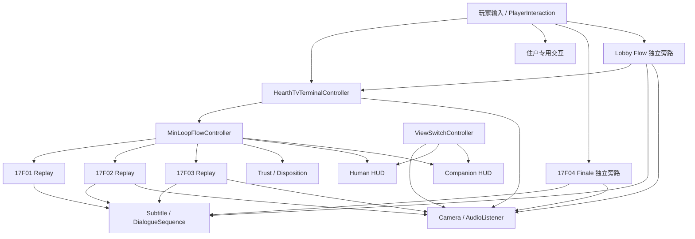

# HEARTH 前序会话完整复盘与续做基线

> 整理日期：2026-07-25
> 续做状态更新：2026-07-26
> 前序 Codex 任务 ID：`019eff8d-9371-7fb0-b3d8-a9569efcce01`
> 前序任务标题：`UI制作`
> 本文性质：会话交接、历史决策复盘、当前状态校准与续做入口。
> 本文不替代正式对白、剧情变更记录、脚本说明或 Unity 实时状态。

## 0. 本次纠正

此前描述中的“绘画”是口述识别错误，全部应理解为“会话”。

因此，本文件总结的不是某一批图像，也不只总结最后一轮 UI V2，而是完整整理前序长会话中：

- 用户提出过的目标与关键决策。
- Codex 实际执行过的主要工作。
- 不同阶段新增、修改和淘汰的系统。
- 反复出现的问题及其共同原因。
- 前序回复中的“完成陈述”与当前现场状态之间的差异。
- 新会话继续工作时应采用的可信基线。

UI 参考图、透明部件和 Prefab 只是这段会话的产物之一，不是会话本身的全部内容。

## 1. 一句话结论

这个前序任务从“整理 UI 说明和 PPT、判断是否需要透明素材”开始，逐步扩展成了一个覆盖几乎整个 HEARTH Demo 的长期制作会话：

```text
UI 资料整理
→ Human HUD
→ TV 终端
→ Companion HUD
→ 17F01/02/03/04 关卡流程
→ 角色、动画、交互与相机修复
→ Lobby、正式对白与音频接口
→ 老师反馈后的体验重构规划
→ Hold E 修复
→ UI V2 视觉接入
→ V2 反复调试与当前架构审计
```

前序会话留下了大量可用代码、Prefab、数据资产、自动工具和说明文档，但也暴露出一个核心问题：

> 现有系统已经“功能很多”，却没有把相机、输入、玩家控制、HUD 显隐、终端会话和编辑器生成链的所有权统一起来。

所以不能继续把每一个可见故障都当作孤立 UI 问题。2026-07-26 已按这个结论完成第一轮
P0 运行拓扑修复：唯一正式 ViewSwitch、五台终端自有相机、共享 Owner 控制锁、终端期间
`R` 门禁和异常停用清理已经接入并完成手工运行验证。下一步不再重复修这批引用，而应继续收敛
Camera/Input/Control/UI 的统一所有权，以及清理 V2 的视觉来源和 Scene Override。

## 2. 本次复盘依据与可信度顺序

本次已经从任务 ID 读取到前序任务最早一轮，覆盖了从最初 UI 资料接收到最后 UI V2 调试的完整会话分页。

继续制作时，各类信息的可信度应按以下顺序判断：

| 优先级 | 信息来源 | 用途 |
|---:|---|---|
| 1 | 用户最新明确指令 | 当前任务意图与最终选择 |
| 2 | `AGENTS.md` 及最新项目规则 | 长期协作规则、文档同步规则、Unity MCP 规则 |
| 3 | 正式对白与最新剧情记录 | 游戏对白、剧情顺序、角色走位和演出意图 |
| 4 | Unity MCP 当前编辑器状态 | 当前层级、组件、引用、Console、Play Mode |
| 5 | 当前代码、Prefab、Scene YAML、数据资产 | 实际实现与序列化状态 |
| 6 | Git 差异与文件状态 | 判断哪些是稳定基线、哪些仍是未提交实验 |
| 7 | 前序会话里的最终回复 | 只能作为历史记录，不能自动视为当前事实 |
| 8 | 旧截图文件名中的 `Fixed`、`Final` | 仅作调试证据，不能单独证明全流程通过 |

若前序回复与当前 Unity 现场冲突，以当前现场和最新用户决策为准。

## 3. 会话范围如何一步步扩大

```mermaid
flowchart LR
    A["UI 资料与 PPT 入库"] --> B["Human HUD 正式 Prefab"]
    B --> C["TV 终端标准化与镜头过渡"]
    C --> D["Companion HUD 与 Robot Controller"]
    D --> E["17F01 / 17F02 最小循环"]
    E --> F["17F03 / 17F04 / Lobby"]
    F --> G["正式对白、动画、音频与角色支持"]
    G --> H["老师反馈后的体验重构文档"]
    H --> I["Hold E 与引用修复"]
    I --> J["UI 组件库与 V2 接入"]
    J --> K["当前架构与现场审计"]
```



这也解释了为什么任务标题虽然仍叫“UI制作”，实际内容早已不只是 UI：

- UI 需要接终端和回放。
- 回放需要接玩家与机器人视角。
- 视角需要接相机、输入和控制锁。
- UI 内容需要接正式对白、信任度、处置记录和关卡状态。
- 关卡又牵涉角色、动画、门、锚点、音频和场景绑定。

这些职责在同一个长会话中持续叠加，最终形成了跨系统状态竞争。

## 4. 前序会话的完整阶段复盘

### 阶段 A：UI 资料接收与开工判断

最初用户提供：

- `HEARTH-HUD.pptx`
- Unity UI 说明书

当时完成的工作包括：

- 把原始资料归档到 `UI参考资料/`。
- 确认 PPT 共 40 页：1–24 为剧情页面，25–40 为组件参考。
- 建立 `UI资料阅读摘要.md`。
- 判断固定框架、装饰和底板可使用图像，动态文字和交互应在 Unity 中实现。

这个阶段确立了第一条长期原则：

> PPT 可以是设计来源，但 Unity 内仍需要可维护的运行时结构。

### 阶段 B：第一版 Human HUD 正式化

随后按 PPT 坐标建立了第一版正式 Human HUD：

- `HearthHudRoot.prefab`
- 24 个页面 Prefab
- 页面、持久层、终端面板、长按交互、按钮行为和预览输入脚本
- PPT 到 Unity Prefab 的 Editor Builder

当时的实现重点是：

- 按 PPT 内部坐标换算到 1920×1080。
- 固定几何与动态 TMP 混合。
- 页面和交互热区可在 Inspector 中继续调整。
- 旧 Demo 脚本不再自动抢画面。

这一阶段也埋下了后续问题：自动生成结果与手工 Prefab 调整之间没有明确的唯一来源。

### 阶段 C：TV 终端从 Human HUD 中分离

用户把部分页面放到 `TV (2)/MonitorCanvas` 后，前序会话确认：

- Human HUD 应保留为 Screen Space Overlay。
- 每台 TV 应拥有独立 World Space `MonitorCanvas`。
- 每台 TV 只放自己的页面组。
- 终端页面切换不能再误操作全局 Human HUD。

之后新增或扩展了：

- `HearthTvTerminalController`
- `HearthTvTerminalInteractable`
- TV 终端 Prefab Builder
- 本地按钮路由
- 3 套终端组 Prefab

终端视觉源又经历了两代：

1. 18 页 PPT 形状与 TMP 重构。
2. 24 页 PPT 选中状态整页透明图，Unity 负责切图和交互逻辑。

最终历史结构为每户 8 张状态页：

- 前 6 张为导航与回放入口。
- 后 2 张为 A/B 选择态。
- A/B 只在机器人回放完成后解锁。
- 回放后可用上下键在资料页与 A/B 页之间切换。

### 阶段 D：终端沉浸式进入、开机效果与相机修复

为了让玩家按 E 后进入固定终端视角，前序会话加入：

- 约 0.5 秒的临时过渡相机。
- 终端暗屏、闪烁、扫描线和开机输入锁。
- 退出时反向过渡。
- 选择高亮与键盘输入。

此后多次出现“从远处飞来”或“先看到错误房间”的问题。

已确认过的历史原因包括：

- 终端曾把旧场景 `Main Camera` 当成玩家相机。
- 总流程曾先切到机器人相机，再把机器人移动到具体住户。
- 17F02 第三幕只保存机器人根朝向，没有保存子相机俯仰。
- 不同终端字段中的 `worldCamera`、玩家相机和终端固定视点语义混在一起。

这些问题后来分别通过真实玩家相机查找、`PrepareReplayStart()`、独立相机锚点等方式局部修复。

### 阶段 E：Robot Controller 与 Companion HUD

用户重建 `Robot Controller` 后，前序会话完成：

- 把 `ViewSwitchController` 的 Companion Rig 重新指向正式机器人。
- 修复机器人相机、AudioListener、移动、视角和交互引用。
- 将机器人相机改名为 `Robot First Person Camera`。
- 切换视角时动态切换 `MainCamera` Tag。
- 建议只保留一个正式可控 Robot Controller，其他位置用锚点或编辑器参考体表达。

随后依据 Companion 视角 PPT 和说明书建立：

- `HearthCompanionHudRoot.prefab`
- 14 个 Companion 场景数据资产
- Companion HUD 控制器、状态区、数据流、长按提示、视线引导、投影和特殊效果
- Companion HUD Builder 与流程 Binder

左上状态区后来从常驻信息改为短时触发卡；黑框、字幕位置、HUD 互斥和机器人速度也在这一阶段反复调整。

### 阶段 F：17F01 最小循环与交互基础

17F01 成为第一个可玩垂直切片，涉及：

- TV 终端进入机器人回放。
- 机器人 HUD 场景切换。
- 床边/男孩交互。
- Hold E 或 E 提示。
- 字幕、信任度和返回 A/B 处置。
- Human HUD 与 Companion HUD 互斥。

期间清理了三套旧占位 Presenter：

- `MinLoopObjectivePresenter`
- `MinLoopRobotHudPresenter`
- `MinLoopTrustPresenter`

并把男孩交互判定从可见模型中拆出，避免删除或替换模型时连交互 Collider 一起丢失。

这一阶段确立了第二条长期原则：

> 可见角色、运行时演员、交互判定体和编辑器参考物不能绑成同一个生命周期。

### 阶段 G：17F02 流程、角色、走位和动画

17F02 是前序会话中返工最多的区域之一。

流程先后经历：

- 女主进门、开门、走到床边。
- 改为女主开场已经在卧室。
- 机器人黑屏被唤醒。
- 女主倾诉后才开放 E 安慰。
- 女主离开时锁定机器人。
- 餐桌对话。
- 黑屏切到男主调用记录的固定视角。
- 争吵音频后回终端。

角色和动画结构也反复调整：

- `Robot Controller (2)/(3)` 从“隐藏参考体”改为“编辑器可见、Play 时隐藏”。
- 女主路径从空 Anchor 改为可视参考模型，再同步为运行锚点。
- `Path01/Path02` 旧路线被新 `BeforeDoor/DoorPause/ExitOutside` 体系替代。
- 旧 PosePreset、Playables、Generic Mixamo 动作和 Humanoid Animator Controller 先后发生冲突。
- 卧室真实女主的绑定曾在旧 Actor 与 `casual_Female_K@Sitting_Disbelief` 之间被后续决策覆盖。
- 最终采用标准 Animator/Humanoid 方向，并继续保留动作 ID 与外层 RuntimeRoot。

这个阶段说明：前序某一轮回复中的角色名或动画方案，不能脱离最新剧情记录和当前 Inspector 单独使用。

### 阶段 H：17F03、17F04 与旁支制作

后续会话继续扩展到：

- 17F03 三幕演员预览、母亲/女儿走位、检查视角、门与交互。
- 17F04 猫路线、结局照片、A/B 输入、低信任弹窗和时间卡。
- 角色 Humanoid 重定向、Mixamo 动作、坐姿与 Root Motion。
- Crowd 静态模型与外部自动绑骨方案评估。
- 音效需求与素材来源清单。

重要历史教训包括：

- 预览演员曾被名称查找误当成运行时演员。
- 某次自动测试把全局 `Time.timeScale` 留在 12，后续才恢复为 1。
- 参考模型、正式演员和动作源对象多次因名称相似被错误显隐或绑定。
- 17F04 猫的 Walk Root Motion、路线速度和转向平滑经过多轮修订。

这些工作属于同一前序会话，但不是当前 UI 架构改造的第一优先级。

### 阶段 I：Lobby、正式对白与全局流程

前序会话又加入了：

- 1F Lobby 玩家开场与可选 NPC。
- 大厅任务终端。
- 电梯解锁与上楼流程。
- 全局字幕、语音接口、终端提示和时间卡。

正式对白来源最终统一为：

`HEARTH_Full_Game_Script_No_Audio_Tags_Native_English.md`

并明确：

- 该文件是正式游戏对白唯一来源。
- ElevenLabs 版本只作表演与情绪参考。
- 当前游戏没有宣传片/序章。
- 不得恢复 `Prologue_HEARTHCommercial`。
- 同步应通过正式 Editor 菜单完成，而不是逐个复制到资产。

这部分规则的权威性高于前序会话中更早的对白资产数量或旧文本描述。

### 阶段 J：老师反馈后的体验重构分析

用户要求先分析、不修改 Unity。

前序会话于是审计现有 UI、对白、终端、交互和关卡，并建立：

- `HEARTH_下一阶段_UI交互改造_00_阅读入口.md`
- `01_当前系统盘点.md`
- `02_UI系统地图.md`
- `03_任务清单与实施链路.md`
- `04_UI风格参考方案.md`
- `05_ImageTool提示词草案.md`
- `06_待确认问题.md`

这一阶段提出的关键方向是：

- 正式人物对白、Field Unit 通讯、Mia 自言自语和系统决策必须分层。
- 终端负责查资料，最终决定应在独立选择界面完成。
- 回放要有清楚的“存档播放”语法。
- 先做 Lobby → 17F01 → 回放 → 决策的完整垂直切片，再批量迁移。

这些是已形成文档的设计方向，但不能误写成已经全部进入当前 Unity。

### 阶段 K：Hold E 与重复引用问题

17F01、17F02、17F03 的 Hold E 提示曾多次不可见。

排查过程中确认过：

- Companion HUD 引用缺失。
- 预览输入干扰正式交互。
- Companion HUD 曾绑定到错误的、禁用的重复 `ViewSwitchController`。
- 场景内实际存在 3 个 `ViewSwitchController`。
- 正式控制器应位于 `MIN_LOOP_ROOT/FlowManagers/ViewSwitchController`。

局部修复后提示曾恢复，但当前场景仍存在重复控制器，因此根因并未完成结构性收口。

### 阶段 L：UI 组件库、V2 Prefab 与最后调试

最后一大阶段是 UI V2：

- 生成多类 UI 视觉参考。
- 拆出 25 个透明 PNG 部件。
- 建立 7 个 V2 Prefab：
  - 1 个 Human HUD
  - 1 个 Companion HUD
  - 5 个终端
- 新增 `HearthUiThemeMarker`。
- 新增 `HearthUiV2Builder`。
- 保留 Legacy/V2 切换。

V2 接入方式是克隆 Legacy 功能结构，再迁移旧实例状态并覆盖视觉。

这使短期功能得以保留，但也带来：

- 大量 Prefab Override。
- Legacy 视觉值重新覆盖 V2。
- Builder、Prefab 和场景实例都像“真实来源”。
- 终端、Human、Companion 的修复逻辑不一致。
- 多轮截图中的 `Final` 状态互相矛盾。

因此，V2 当前应定义为：

> 已进入场景的技术原型与视觉方向，不是已稳定验收的生产版本。

## 5. 前序会话留下的主要成果

| 子系统 | 可确认成果 | 当前定位 |
|---|---|---|
| UI 资料 | PPT、说明书、阅读摘要、视觉参考 | 设计输入 |
| Human HUD | 根 Prefab、页面、历史、设置、地点、流程绑定 | 有功能，结构仍需治理 |
| TV 终端 | 世界空间终端、页面、输入、相机、开机、剧情路由 | 功能集中度过高 |
| Companion HUD | 根 Prefab、14 个场景数据、交互与特效组件 | 有数据驱动基础 |
| MinLoop | 17F01–03 最小循环、信任度、处置和返回终端 | 17F01–03 协调器，不统管 Lobby 与 17F04 |
| 17F01–04 | 四户专用流程、演员、锚点、交互、字幕与演出 | 可玩程度不同 |
| Lobby | 开场、NPC、任务终端、电梯 | 已接入但与 UI 状态有冲突风险 |
| 对白 | 正式 Markdown、同步工具、DialogueSequence | 已有唯一来源规则 |
| 动画 | 通用动作 Driver、Humanoid/Animator 接入方向 | 部分角色仍需逐段验证 |
| 音频 | 语音接口、SFX 清单、触发入口 | 资源绑定未完整 |
| Editor 工具 | Builder、Binder、同步、迁移、验证 | 数量多、执行顺序敏感 |
| 文档 | 脚本总表、剧情记录、接口、审计和老师总览 | 内容丰富但需按优先级阅读 |
| UI V2 | 25 个部件、7 个 Prefab、主题标记和切换工具 | 技术原型 |

## 6. 当前代码与程序结构总览

前序会话形成的实际运行链可概括为：



主要结构问题不是“模块不存在”，而是箭头末端存在多个直接写入者：

- 多个脚本直接启停 Camera 和 AudioListener。
- 多个脚本直接启停玩家移动、视角、交互和 R 切换。
- 多个脚本直接修改 Canvas、GameObject Active 和 CanvasGroup。
- 多个脚本各自保存旧 bool，再尝试恢复。
- 多个 Editor 工具会重建、替换或重新绑定同一对象。

完整代码职责、执行顺序、依赖关系、影响矩阵和重构建议见：

`HEARTH_下一阶段_UI交互改造_07_代码架构与重构路线图.md`

## 7. 仍然有效的用户决策

下列决策应作为后续工作的默认前提，除非用户再次明确修改：

1. 进入终端固定视角时，全部第一人称 UI 都应隐藏。
2. 退出终端后，应精确恢复进入前的相机、控制和 HUD 状态。
3. Human、Companion、终端是三类不同 UI，不应互相混成一个根系统。
4. 正式对白唯一来源是 `HEARTH_Full_Game_Script_No_Audio_Tags_Native_English.md`。
5. 当前不包含宣传片/序章，不恢复 `Prologue_HEARTHCommercial`。
6. 最新剧情变更记录优先于旧会话记忆和旧资产文字。
7. 场景里应有一个正式 Human Controller 和一个正式 Robot Controller；额外对象只能作为明确标记的参考体或演员。
8. 可见模型、运行时演员、交互 Collider、动作源和编辑器参考物必须分离。
9. UI 的固定视觉可以来自图像；动态文字、状态和交互应保留可维护接口。
10. 后续开始大改前，应先理解代码结构、影响顺序和依赖，再实施。
11. 修改 Unity/C# 脚本后必须同步更新 `脚本使用说明总表.md`。
12. 口述剧情、流程、演出和 UI 触发条件变化必须写入 `HEARTH_剧情变更记录.md`。

## 8. 已被覆盖或只能视为历史的旧结论

以下内容曾在前序会话中成立，但不能直接继续沿用：

| 历史结论 | 当前处理 |
|---|---|
| 旧 DialogueSystem 是正式入口 | 已由 DialogueSequence 与正式同步链替代 |
| 三套 MinLoop 占位 Presenter 继续使用 | 已删除并由正式 HUD 替代 |
| Robot Controller (2)/(3) 应永久 inactive | 后续改为编辑器可见、Play 时隐藏的参考体 |
| 17F02 女主使用旧 `Actor_Wife_17F02_Bedroom` | 被后续真实女主与 Animator 决策覆盖 |
| 17F02 用 Playables 直接播 Generic Mixamo | 后续改为 Humanoid/Animator Controller 方向 |
| 终端 18 页形状/TMP 是最终源 | 后续改成 24 页状态图，再进入 V2 方案 |
| 截图名带 `Final` 即完成 | 只能作为历史调试截图 |
| 某次 Console 为 0 Error 即全部流程通过 | 只代表当次刷新/过滤范围 |
| V2 已完整稳定 | 当前实时审计不支持该结论 |

## 9. 前序“完成陈述”与当前现场差异

前序最后阶段曾表示：

- V2 已放入场景。
- 终端能隐藏全部第一人称 UI 并恢复。
- 25 个部件与 7 个 V2 Prefab 已生成。
- Legacy/V2 可切换。
- Unity MCP 检查没有新增编译错误。

其中资产和工具确实存在，但“整体稳定”目前不能成立。

2026-07-25 通过 Unity MCP HTTP 实时复核到以下“修复前现场”：

| 项目 | 当前现场 |
|---|---|
| Unity | `2022.3.61f1c1` |
| 场景 | `Assets/Scenes/SampleScene.unity`，Dirty |
| Play/Compile | 当前未在 Play，也未处于编译中；本轮未重新触发编译或 Play Mode 验证 |
| Human V2 | 1 个 |
| Companion V2 | 1 个 |
| V2 终端 | 5 个 |
| Theme Marker | 共 7 个 |
| ViewSwitchController | 3 个，只有 1 个应为正式控制器 |
| HearthLocationProbe | 当前序列化引用指向禁用的重复 ViewSwitchController |
| 17F02 终端相机 | 错指玩家 First Person Camera |
| 17F04 终端相机 | 错指玩家 First Person Camera |
| TV 自有 Camera | 两台错误终端层级中实际都存在 |
| 终端控制锁数组 | 5 个 V2 Prefab 均为空；场景仅见一个 size=3 Override，未见有效元素引用 |
| R 切换 | `ViewSwitchController.Update()` 存在无全局门禁的 R 输入路径，实际阶段表现待 Play Mode 验证 |
| Human 场景 Override | 约 1435 个 |
| Companion 场景 Override | 约 200 个 |
| V2 视觉来源 | Builder、Prefab、Legacy 状态和 Scene Override 并存 |
| Git 状态 | V2 Builder、Prefab、素材和相关文档多数未跟踪；场景与若干脚本有未提交修改 |

因此，当前真实基线是：

- 这张表保留为 P0 修复的审计依据，不再代表 2026-07-26 的最新运行拓扑。
- 当前场景中的 V2 数量齐全，但相关资产多数尚未进入稳定版本基线。
- 视觉来源和大量 Scene Override 仍未收口，不能直接批量重建或宣布 UI 视觉交付。
- 最新修复与验证结果以第 11、12、14 节的 2026-07-26 更新为准。

## 10. 前序会话反复返工的共同原因

### 10.1 会话范围持续扩大，没有冻结阶段基线

同一任务同时承担了：

- 设计判断。
- 资产导入。
- 代码实现。
- 场景绑定。
- 剧情改写。
- 动画调试。
- 视觉验证。
- 项目审计。

每一轮局部完成后，下一轮又改变上游假设，导致旧绑定和旧文档被覆盖。

### 10.2 名称查找代替了明确身份

大量工具依赖：

- `FindObjectOfType`
- `GameObject.Find`
- 名称包含 Human、Robot、TV、Actor 或编号
- 层级路径和同类型组件序号

这在场景出现副本、参考体、预览演员和旧对象时很容易选错。

### 10.3 状态没有唯一所有者

相机、AudioListener、移动、视角、交互、模式切换和 HUD 显隐被不同脚本分别修改。

各脚本保存的“旧状态”可能在恢复时已经过期，于是出现：

- 退出终端后 HUD 不回来。
- Lobby HUD 被二次关闭。
- 存在剧情期间通过无全局门禁的 R 输入路径绕过流程的风险。
- 相机被其他流程重新启用。
- AudioListener 数量不唯一。

### 10.4 Builder、Binder 与手工调整互相覆盖

前序会话多次出现：

```text
手工调好
→ 运行 Binder / Builder
→ Prefab 或场景被重建
→ 手工状态丢失
→ 再加修复函数
```

特别是：

- 旧 Binder 可能重新生成 Legacy 终端。
- V2 Builder 又从 Legacy 克隆。
- `CopyMonoBehaviourState()` 会复制 TMP、Image、Canvas 等视觉状态。
- 场景 Override 再成为第三份状态。

### 10.5 “非空”被误当成“正确”

相机修复和验证多次只检查引用是否为空。

17F02、17F04 的相机虽然指错，但不是 Null，所以自动检查会放行。

### 10.6 验证覆盖过窄

历史验证往往只覆盖：

- 是否编译。
- 数量是否存在。
- 某一张截图是否看起来正确。
- 某个瞬时字段是否符合预期。

没有持续覆盖：

- 五台终端逐台打开、退出。
- 中途禁用、切场景和异常退出。
- Human/Companion/R 输入互斥。
- 相机与 AudioListener 唯一性。
- HUD 精确恢复。
- Builder 前后是否产生非预期差异。

### 10.7 自动测试曾改变全局或场景状态

前序历史中出现过：

- `Time.timeScale` 被留在 12。
- 场景在测试后保持 Dirty。
- 自动保存把临时绑定写回场景。
- 调试截图来自不同版本和不同状态。

后续测试必须明确记录并恢复所有全局状态。

## 11. 当前完成度

| 内容 | 状态 | 说明 |
|---|---|---|
| 前序会话历史 | 可访问分页已全部读取 | 已从任务接口可访问的最早 UI 资料接收到最后 V2 调试 |
| 代码结构总览 | 已整理 | 见第 07 份架构路线图 |
| Human/Companion/5 Terminal V2 | 当前场景已存在 | 数量正确，但多数相关资产未跟踪 |
| UI 视觉方向 | 已有历史方向 | 可继续参考，尚未完成最终验收 |
| 透明部件库 | 已形成原型 | 25 个，实际使用与导入仍需收口 |
| Legacy 保留与 V2 切换 | 隔离事务验证已通过 | 完成双向切换、Undo/Redo 与保存重载；视觉 Override 与正式来源仍未收口，本轮未重建资产 |
| 四户与 Lobby 流程 | 已有实现 | 可玩程度和稳定性不同 |
| 正式对白同步链 | 规则和工具已存在 | 本轮未重新执行 Sync 与 Coverage Validation |
| 终端相机引用 | P0 已完成 | 五台终端均绑定自身 TV 层级 Camera；17F02/17F04 已纠正 |
| 正式 ViewSwitch 唯一性 | P0 已完成 | 场景仅保留 `MIN_LOOP_ROOT/FlowManagers/ViewSwitchController` |
| 输入和控制锁 | P0 已完成、总体架构仍待收口 | 共享 Owner 锁、全局锁状态、终端 `R` 门禁和单终端会话已验证；尚未建立完整 InputRouter |
| HUD 与控制恢复 | P0 路径已验证 | 五台终端正常关闭和 17F01 中途停用通过；Lobby/Replay/剧情嵌套仍需垂直切片验收 |
| Runtime Topology 工具 | 已建立并通过 | 可只读验证唯一 ViewSwitch、页面引用、五台终端相机/锁、转场 Listener 与关键回调 |
| V2 切换事务 | 已通过隔离场景验证 | 七个根整体替换；失败回滚、Undo/Redo、保存重载后再次验证均通过 |
| Lobby 循环音频绑定 | 路由已持久化 | `activeLoopCuePlayer` 指向 `StorySFX_Lobby`；`AssignmentTerminal.Hum` 的正式 AudioClip 仍待绑定 |
| V2 唯一来源 | 未建立 | Legacy、Builder、Prefab、Override 并存 |
| 五终端基础运行矩阵 | 已手工完成 | 五台均完成打开、稳定、关闭；不等同于五户完整剧情端到端 |
| 自动测试 | 未建立 | 缺 EditMode/PlayMode 组合测试 |
| 正式截图基线 | 未建立 | 当前多为不同阶段调试图 |

## 12. 下一阶段优化顺序

### P0：运行拓扑修复已完成

2026-07-26 已执行：

1. 新增 `HearthRuntimeTopologyTools`，先做无修改预检，修复失败时回滚。
2. 只保留一个正式 `ViewSwitchController`，并把场景内旧引用重映射到正式对象。
3. 修正 `HearthLocationProbe`、流程控制器、HUD Binder 和 Editor Binder 的首选控制器查找。
4. 修正五台终端的 `terminalCamera`、`terminalHardwareRoot`、`worldCamera`、共享控制锁与正式 ViewSwitch 引用。
5. `terminalCamera` 只接受终端硬件层级中的自有 Camera，不再从 Canvas 或玩家相机兜底。
6. 转场 Camera 保持 AudioListener 连续性；终端正常关闭和中途停用都释放自己的锁与相机状态。
7. 两个只读验证器通过；五台终端基础打开/关闭、17F01 中途停用和双 Owner 嵌套锁通过。

仍未完成的“基线冻结”是 Git/Prefab/截图的正式版本归档；当前工作区仍包含前序任务未提交改动，
因此不要把“P0 运行拓扑已修复”误写成“整个项目已经形成稳定提交”。

### P1：继续统一运行状态所有权

当前 `HearthPlayerControlLock` 的 Owner 模型已承担第一步，但 Camera、HUD、Cursor 和剧情输入上下文仍没有
完整的统一服务。后续按第 07 份架构路线图逐步引入或收口：

- `HearthInputRouter`
- `HearthControlStateService`（可在现有 Owner Lock 上演进）
- `HearthCameraStateService`
- `HearthUiVisibilityService`
- `HearthRuntimeContext`

旧公开方法先保留，通过适配器迁移，不做一次性全项目重写。

### P2：收敛 UI 资产与编辑器工具

1. 已停止在 V2 场景迁移中复制全部 MonoBehaviour 状态；继续检查是否还有其他旧工具采用同类做法。
2. 当前只白名单迁移根控制器功能字段；仅 Lobby 两个回调和 17F04 Home 一个回调按明确规则迁移，
   不迁移 TMP、Graphic、Canvas 或任意通用 UnityEvent。
3. 决定 V2 的唯一来源：
   - V2 Prefab 是正式源；或
   - 生成规则是正式源。
4. Builder、Binder、Migration、Validator 分离职责。
5. 场景保留稳定 Wrapper，只替换视觉子节点。
6. 建立 Theme/Layout ScriptableObject 和明确的 Slot/Identity。

### P3：建立垂直切片验收

P0 的五台终端基础开关矩阵已经通过，下一步仍应先完整验收：

`Lobby → 17F01 Terminal → Replay → Decision → Result → Return`

通过后再迁移 17F02、17F03、17F04。

每个终端至少验证：

- 打开前状态。
- 进入过渡。
- 终端内输入。
- 回放切换。
- 返回终端。
- A/B 决策。
- 正常退出。
- 中途禁用。
- 重复打开。
- Human/Companion HUD 与 R 输入互斥。

## 13. 新会话续做协议

以后继续这个项目时，建议固定执行：

1. 读取 `AGENTS.md`。
2. 读取本文件。
3. 读取 `HEARTH_下一阶段_UI交互改造_07_代码架构与重构路线图.md`。
4. 涉及对白时读取正式对白唯一来源。
5. 涉及剧情时读取最新 `HEARTH_剧情变更记录.md` 和接口文档。
6. 读取 `脚本使用说明总表.md` 中相关脚本条目。
7. 通过 Unity MCP 检查当前场景、Console、Play Mode、层级和引用。
8. 检查 Git 工作区，区分用户现有修改与本轮范围。
9. 在修改前写清本轮只处理哪一条完整链路。
10. 修改后做端到端验证，并同步对应文档。

禁止把前序任务的某一句“已经完成”直接当成当前事实。

## 14. 续做交接摘要

如果新会话只能先读一段，使用下面这段：

> 前序任务 `019eff8d-9371-7fb0-b3d8-a9569efcce01` 是一个从 UI 资料整理扩展到全项目流程、角色、交互、对白和 UI V2 的长期会话。当前已经有 Human、Companion、五台终端、四户流程、Lobby、正式对白同步链和 V2 视觉原型。2026-07-26 已完成第一轮 P0：场景仅保留正式 ViewSwitch，五台终端都绑定自身 TV Camera，终端使用共享 Owner 控制锁并阻断 `R`，五台基础开关与 17F01 中途停用已经通过 Unity MCP 手工验证；V2/Legacy 七根整体切换也已在隔离场景通过双向切换、Undo/Redo 和保存重载验证。不要再按旧审计表重复修 17F02/17F04 相机。Lobby 循环音频路由已持久化，但 `AssignmentTerminal.Hum` 的正式 AudioClip 仍待绑定。剩余重点是 Camera/Input/Control/UI 的完整统一所有权、V2 大量 Scene Override、Companion `statusPanelView` 未绑定，以及缺少 EditMode/PlayMode 自动化测试；不要直接继续批量重建 V2。
