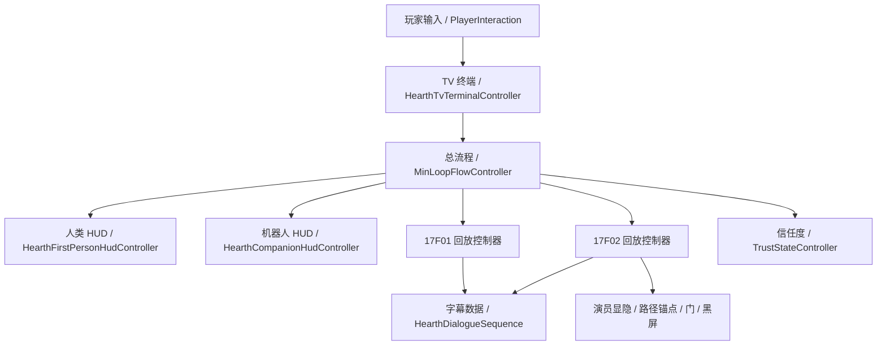

# HEARTH 脚本审计与优化整合方案

> 日期：2026-07-05  
> 范围：本文件只审计项目内 Codex 参与新增、修改或重构的 HEARTH 自研脚本与工具；第三方资源包脚本如 `Standard Assets`、`polyperfect`、`hazelwoodloft`、`Free Wood Door Pack` 只作为外部依赖，不在本次“自研脚本整合”范围内。  
> 配套文档：`脚本使用说明总表.md` 记录具体挂载和 Inspector 字段；本文记录“为什么这样分层、哪些可以整合、下一步怎么规范化”。

## 1. 本次已完成的清理

本次清理删除了高置信度旧脚本，并用 Unity MCP 移除了 `SampleScene` 中旧 `DialogueSystem` / `DialogueTrigger` 场景物体。

| 已删除脚本 | 原用途 | 删除理由 | 替代方案 |
|---|---|---|---|
| `Assets/TerminalInteractable.cs` | 旧版空白终端入口。 | 正式 TV 终端已由 `HearthTvTerminalInteractable` 接管，旧入口容易造成重复触发。 | `HearthTvTerminalInteractable` / `ResidentTerminalFlow` |
| `Assets/DialogueSystem.cs` | 旧版黑底对话框。 | 会生成大黑框，和现在无黑底居中字幕方向冲突。 | `MinLoopSubtitlePlayer` / `HearthDialogueSequence` |
| `Assets/DialogueTrigger.cs` | 旧版看向物体按 E 播放对话。 | 剧情交互现在必须受关卡阶段控制，不能独立乱触发。 | 17F01/17F02 回放控制器中的阶段条件 |
| `Assets/DialogueLine.cs` | 旧版对白数据。 | 只服务旧对话系统。 | `MinLoopSubtitleLine` |
| `Assets/IDialogueSource.cs` | 旧版对白触发接口。 | 旧触发链路删除后无用途。 | 关卡流程公开方法 / UnityEvent |
| `Assets/Scripts/EventTemplpate.cs` | UnityEvent 练习模板。 | 无引用，且命名拼写错误。 | 正式脚本按需暴露 UnityEvent |
| `Assets/Scripts/UI/HearthHudDemoController.cs` | 早期运行时 HUD 全页预览。 | 正式 HUD 已拆分，旧 Demo 容易制造黑框和重复 UI。 | `HearthHudRoot` / `HearthCompanionHudRoot` / TV 终端系统 |

同时修改：

- `Assets/Editor/HearthTvTerminalPrefabBuilder.cs` 去掉对已删除 `TerminalInteractable` 的直接引用。
- `脚本使用说明总表.md` 和 `最小循环制作清单.md` 已标注旧脚本删除状态。

## 2. 当前系统真实分层

现在项目不是“一个大脚本控制全部”，而是已经分成几套系统：



这个分层是对的，但现在的问题是：17F01、17F02 已经开始出现“每户一个专用控制器，字段很多，部分逻辑重复”的趋势。继续做 17F03 前，最好开始抽公共框架。

## 3. 自研脚本职责理解

### 玩家与通用交互

| 脚本 | 作用 | 关键接口 |
|---|---|---|
| `PlayerInteraction.cs` | 屏幕中心射线，找到实现 `IInteractable` 的物体并按 E 调用。 | `SetInteractionEnabled`、`SetInteractionCamera`、`ForceRefreshPrompt` |
| `IInteractable1.cs` | 项目当前可交互接口。 | `Interact()`、`GetDescription()` |
| `ViewSwitchController.cs` | 人类/机器人视角切换，处理相机和控制器启停。 | `SwitchToHuman`、`SwitchToCompanion`、`CurrentMode` |
| `FirstPersonLook.cs` | 第一人称视角旋转，同步传送后的视角角度。 | `ForceLookAngles`、`ForceLookFromCurrentTransforms` |
| `Jump.cs` / `Crouch.cs` 修改部分 | 禁用跳跃、蹲伏，避免 UI 操作时误触动作。 | `SetJumpEnabled`、`SetCrouchEnabled` |

### 最小循环通用层

| 脚本 | 作用 | 关键接口 |
|---|---|---|
| `MinLoopTypes.cs` | 流程阶段、处置选择、字幕行等公共类型。 | `MinLoopStage`、`MinLoopDispositionChoice`、`MinLoopSubtitleLine` |
| `MinLoopFlowController.cs` | 总流程导演，连接终端、回放、信任度、处置。 | `RequestReplayFromTerminal`、`ChooseDispositionA/B`、`NotifyReplayCompleted` |
| `TrustStateController.cs` | 信任度加减、阈值判断、历史状态来源。 | `ApplyChoice`、`SetTrust`、`TrustChanged` |
| `MinLoopSubtitlePlayer.cs` | 播放字幕序列，支持后续语音 AudioClip。 | `PlaySequence`、`Stop`、`SetSubtitleAnchors` |
| `HearthDialogueSequence.cs` | 字幕数据资产，每句可调 speaker/text/duration/audio。 | ScriptableObject 数据，不挂载 |
| `MinLoopStageObjectActivator.cs` | 按阶段显示/隐藏对象。 | `ApplyStage` |
| `MinLoopStageAnchorController.cs` | 按阶段移动/对齐角色到锚点。 | `ApplyRuleNow`、`ApplyStage` |
| `MinLoopStageCueController.cs` | 阶段进入时触发 UnityEvent、音效、门等。 | UnityEvent 规则 |
| `MinLoopAudioStateController.cs` / `MinLoopLightingStateController.cs` | 按阶段切换声音和灯光。 | 阶段规则 |

### 住户回放层

| 脚本 | 作用 | 关键接口 |
|---|---|---|
| `HearthCompanion17F01ReplayController.cs` | 第一户回放：儿童房、看向小男孩、安抚、客厅观察、回终端。 | `BeginReplay`、`CompleteCurrentStep`、`ReturnToTerminalForDisposition` |
| `HearthCompanion17F02ReplayController.cs` | 第二户回放：黑屏开场、卧室倾诉、E 安慰、女主离开、餐桌、第三幕、黑屏争吵。 | `BeginReplay`、阶段推进方法、演员显隐/路径字段 |
| `HearthCompanionReplayInteractable.cs` | 回放里的条件交互物，例如小男孩胶囊体。 | `SetAvailable`、`CanInteract` |
| `HearthActorPosePreset.cs` | 静态姿势保存/应用，临时代替正式动画。 | `ApplyPose`、`CaptureCurrentPose` |
| `HearthEditorOnlyReferenceModel.cs` | 编辑器参考模型，Play 时隐藏 Renderer/Collider。 | 自动隐藏，不作为正式演员 |
| `HearthRouteAnchorGizmo.cs` | Scene 视图显示路线点和朝向。 | Gizmo 可视化 |

### TV 终端层

| 脚本 | 作用 | 关键接口 |
|---|---|---|
| `HearthTvTerminalInteractable.cs` | 玩家看向 TV 按 E 打开终端。 | `Interact`、`SetTerminalController` |
| `HearthTvTerminalController.cs` | 每台 TV 本地页面、输入、A/B、回放请求。 | `OpenTerminal`、`CloseTerminal`、`ShowPage`、`RequestRobotReplay` |
| `HearthTerminalCameraTransition.cs` | 终端相机 0.5 秒平滑过渡。 | `TransitionToTerminal`、`TransitionToPlayer` |
| `HearthTerminalBootSequence.cs` | 终端暗屏、开机闪烁、扫描线。 | `PlayOpenSequence`、`PlayCloseSequence` |
| `HearthTerminalSelectionHighlighter.cs` | 终端导航/选项高亮框。 | `SetTargets`、`SetFocus`、`SetVisible` |
| `HearthHudPage.cs` / `HearthHudButtonAction.cs` / `HearthHudTypes.cs` | TV 页面 Prefab 仍在使用的基础页类型和按钮动作。 | `Show/Hide`、`InvokeAction` |

### 人类 HUD 层

| 脚本 | 作用 | 关键接口 |
|---|---|---|
| `HearthFirstPersonHudController.cs` | 人类视角 HUD 总控，菜单、警告、结局、浮字。 | `ShowPage`、`ShowTrustDelta`、`RegisterDisposition` |
| `HearthFirstPersonHudInput.cs` | Tab/Esc/方向键/Space 输入。 | 输入集中入口，后续 VR 可调用公开方法 |
| `HearthFirstPersonHudFlowBinder.cs` | 把最小循环和信任度同步到 HUD。 | 事件绑定 |
| `HearthDispositionHistoryView.cs` | 今日历史，只显示已完成住户。 | `SetRecords`、`Refresh` |
| `HearthSettingsView.cs` | 设置页焦点与音量接口。 | Master/Dialog/Ambient/SFX UnityEvent |
| `HearthLocationProbe.cs` / `HearthLocationHudView.cs` / `HearthLocationSurface.cs` | 脚下位置判定与右下角 LOCATION 常亮显示。 | `ShowLocation`、`RefreshCurrentLocation` |
| `HearthPlayerControlLock.cs` | HUD/终端打开时锁玩家控制。 | `SetControlLocked`、`SetDisableCrouchAlways` |

### 机器人 HUD 层

| 脚本 | 作用 | 关键接口 |
|---|---|---|
| `HearthCompanionHudController.cs` | 机器人 HUD 总控，按 sceneId 显示页面。 | `ShowScene`、`SetVisible`、`ShowBlackAudio` |
| `HearthCompanionHudSceneData.cs` | 每个机器人页面的数据资产。 | sceneId、右上决策、左下数据流、timed cue、特效 |
| `HearthCompanionDecisionPanelView.cs` | 右上长期决策区。 | `SetDecision` |
| `HearthCompanionDataStreamView.cs` | 左下数据流。 | `SetLines` |
| `HearthCompanionTriggerCardView.cs` | 左上短时监控卡。 | `ShowCard`、自动淡出 |
| `HearthCompanionHoldPrompt.cs` | 长按 E 提示。 | `SetVisible`、`SetProgress` |
| `HearthCompanionSpecialEffectsView.cs` | 黑屏、故障、深眠等。 | `ShowBlackAudio`、`PlayShutdownGlitch` |
| `HearthCompanionHudFlowBinder.cs` / `HearthCompanionHudExclusiveMode.cs` | 跟随视角切换显隐，保证人类 HUD 和机器人 HUD 不叠。 | 事件绑定 |

### Editor 自动化工具

| 脚本 | 作用 |
|---|---|
| `Hearth17F01MinimalLoopBinder.cs` | 绑定第一户锚点、角色、终端、回放控制器。 |
| `Hearth17F02MinimalLoopBinder.cs` | 绑定第二户锚点、参考女主模型、角色显隐、门、字幕资产。 |
| `HearthCompanionHudBuilder.cs` | 重建机器人 HUD Prefab 和数据页。 |
| `HearthFirstPersonHudBuilder.cs` | 重建人类 HUD Prefab。 |
| `HearthTvTerminalPrefabBuilder.cs` / `HearthTvTerminalSlideImageBuilder.cs` | 从 PPT/图片页生成 TV 终端 Prefab，并标准化 TV 结构。 |
| `HearthLocationDetectionSceneBinder.cs` | 自动给地面 Mesh/Collider 标地点。 |
| `MinLoopSceneAutoBinder.cs` / `MinLoopSceneSkeletonCreator.cs` / `MinLoopSceneValidator.cs` | 早期最小循环搭建和检查工具，部分仍可用，但后续应逐渐并入 HEARTH 专用 Binder。 |

## 4. 仍不建议现在删除的内容

| 候选 | 当前判断 |
|---|---|
| `TerminalUIController.cs` | 看起来偏旧，但仍被 `MinLoopTerminalPresenter` 等早期链路提到。除非确认不再需要旧最小循环占位终端，否则先保留。 |
| `HearthHudController.cs`、`HearthHudPersistentView.cs`、`HearthDoorwayTerminalPanel.cs`、`HearthHoldToActButton.cs`、`HearthHudPreviewInput.cs` | 旧“正式 HUD 第一版”组件，大多没有场景引用，但 `HearthHudPage/HearthHudButtonAction/HearthHudTypes` 仍被 TV 终端 Prefab 用。应先重命名/迁移 TV 依赖，再决定是否归档。 |
| 城市生成工具 `CityLotAssetPlacer*` / `CityFacadeBillboardPlacer*` | 与当前 17F 关卡无关，但可能服务外景城市和窗外世界观。暂不删，建议后续放入 `Tools/City` 目录并在文档里标为“可选美术工具”。 |
| 第三方资源包 demo 脚本 | 数量很多，但可能被资源包 Prefab 或示例场景引用。不要手动逐个删；若要瘦身，建议先按资源包目录整体归档或用 Unity 依赖分析。 |

## 5. 优化整合方案

### 第一阶段：把“每户流程”抽成数据

新增一个核心数据资产：

`HearthResidentReplayConfig`

建议字段：

- Resident Id：`17F01`、`17F02`、`17F03`
- Terminal Controller / Terminal Group
- Robot Start Anchor、主要阶段 Anchor
- Actors：男主、女主、孩子、参考模型父级
- Dialogue Sequences：黑屏、倾诉、安慰、餐桌、争吵等
- Companion HUD Scene Ids
- Disposition Options：A/B 标题、副标题、信任变化
- Stage Rules：每阶段是否允许移动、是否允许转头、是否黑屏、是否等玩家按 E

这样 17F03 不需要再复制一个巨大脚本，只需要配一个新 Config。

### 第二阶段：把 17F01/17F02 控制器合并成通用回放控制器

保留住户专用脚本作为“薄壳”，但核心逻辑迁到：

`HearthResidentReplayController`

它只做这些事：

1. 读取 `HearthResidentReplayConfig`。
2. 按阶段播放字幕、控制 HUD、锁移动、显隐角色。
3. 等待条件：时间结束、玩家按 E、看向目标、Timeline 播完。
4. 回终端并通知 `MinLoopFlowController`。

住户差异交给 Config，不再让每户脚本越来越长。

### 第三阶段：把复杂演出交给 Timeline

17F02 女主开门、走出房间、餐桌切第三幕、黑屏争吵，已经是“演出序列”，不适合继续全靠脚本坐标移动。建议：

- 简单自由观察仍由脚本控制。
- 需要固定顺序、音效、黑屏、门、演员位移的段落用 Unity Timeline。
- Timeline 末尾用 Signal 调用 `AdvanceStage()`。

这会让你更容易自己调动作和节奏：你可以在 Timeline 里拖动画片段、音效和黑屏时间，而不是每次改脚本。

### 第四阶段：UI 用 Prefab Variant 和 Layout Config 统一

建议建立：

- `Terminal_Base.prefab`
- `Terminal_17F01.prefab`、`Terminal_17F02.prefab`、`Terminal_17F03.prefab` 作为 Variant
- `CompanionHudRoot.prefab` 只保留框架和通用 View
- 每页内容走 `HearthCompanionHudSceneData`
- HUD 大小/位置统一放到 `HearthHudLayoutConfig`，让你在 Inspector 中改一次，三户一起生效

这样你问“第二户、第三户会不会跟着我调第一户 UI”时，答案就会变成：如果改 Base 或 Config，会一起变；如果改 Variant，只影响单户。

### 第五阶段：命名与目录整理

后续建议逐步迁移到：

```text
Assets/_HEARTH/
  Scripts/
    Core/
    Interaction/
    Flow/
    Replay/
    UI/
    Editor/
  Data/
    Residents/
    Dialogue/
    Hud/
  Prefabs/
    HUD/
    Terminals/
    Replay/
  Docs/
```

当前不需要马上搬，因为 Unity 引用很多，直接搬容易造成大量 `.meta` 和 Prefab 变更。建议等 17F03 前做一次“结构整理专门任务”。

## 6. 我参考的 Unity 制作经验

- Unity 官方 ScriptableObject 架构建议：强调把可变数据从场景脚本中拆出去，减少硬引用，让系统更容易改、更容易调试。参考：`https://unity.com/how-to/architect-game-code-scriptable-objects`
- Unity Timeline 官方说明：Timeline 适合制作 cut-scene、game-play sequence、audio sequence 和复杂特效序列。17F02 的女主离开、门、黑屏和争吵非常适合逐步迁进去。参考：`https://docs.unity3d.com/Packages/com.unity.timeline@1.2/manual/index.html`
- Unity Prefab Variant 官方说明：Prefab Variant 适合同一类对象有不同配置，例如同一套 TV 终端结构但不同住户内容、不同音效、不同默认页面。参考：`https://docs.unity3d.com/6000.1/Documentation/Manual/PrefabVariants.html`

## 7. 下一步建议

1. 做 17F02 前，先把现有第二户流程稳定下来，不急着抽象。
2. 17F02 稳定后，新增 `HearthResidentReplayConfig`，先只承接 17F02 数据。
3. 再把 17F01 也迁入同一套 Config，验证通用控制器确实能覆盖两户。
4. 开始 17F03 前，禁止再复制一份巨大的 `HearthCompanion17F03ReplayController`，而是用 Config + 通用控制器扩展。
5. 演出复杂段落逐步引入 Timeline，先从“17F02 女主离开房间”这一段试点。
