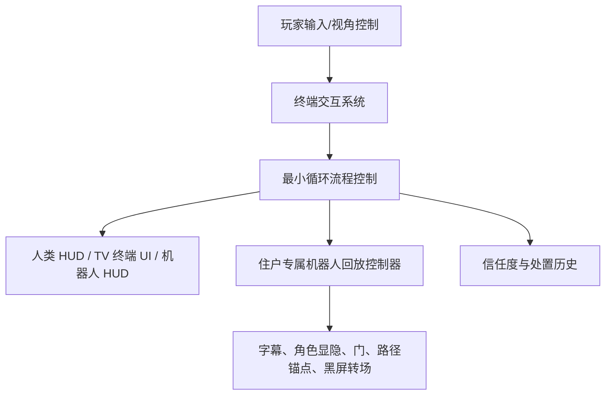
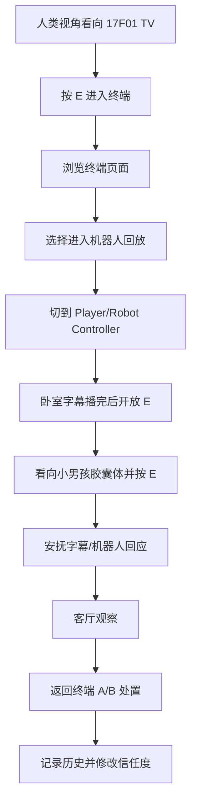
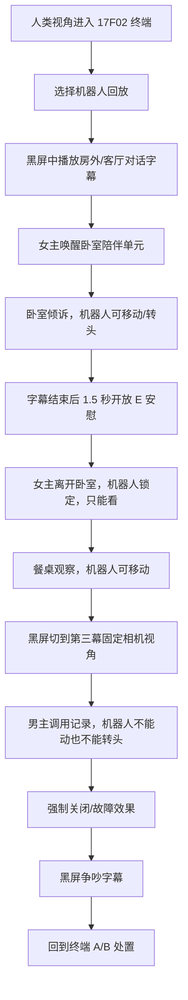

# HEARTH 项目代码逻辑与制作过程总览（给老师）

> 本文档用于向老师说明当前 Unity 项目的程序结构、制作流程和可检查点。  
> 项目路径：`D:\UGit\GAME-CBY`  
> 当前主要场景：`Assets/Scenes/SampleScene.unity`  
> Unity 版本：`2022.3.61f1c1`  
> 当前 MCP 验证：已通过第三方 `MCP for Unity` 连接到 `GAME-CBY@ce06e3f26f537e83`。

## 1. 项目目标

本项目是一个第一人称叙事交互 Demo，核心玩法是：

1. 玩家以人类巡查员视角在 17 层夜巡。
2. 玩家靠近每户门口的 TV/终端，按 `E` 进入终端固定视角。
3. 终端内查看住户资料、昨夜记录、信任趋势等 UI。
4. 玩家选择进入“陪伴单元机器人回放”。
5. 玩家切换到该户家中陪伴单元机器人的第一人称视角，体验昨夜事件。
6. 回放结束后回到终端，玩家做 A/B 处置选择。
7. 处置影响信任度与历史记录，最终进入不同结局判断。

当前已重点实现 17F01 和 17F02 的最小游戏循环；17F03 和最终结局保留了接口与 UI 数据结构，后续可以复用扩展。

## 2. 总体架构

项目目前被拆成五层：



这样的拆法目的是：剧情文本、UI 内容、场景摆位、流程脚本尽量分开，方便后续在 Unity Inspector 里改，不需要每次都改代码。

## 3. 关键运行时对象

| 对象/层级 | 作用 |
| --- | --- |
| `MIN_LOOP_ROOT` | 当前最小循环的总根节点，下面放流程管理器、字幕、锚点、住户回放控制器。 |
| `MIN_LOOP_ROOT/FlowManagers/MinLoopFlowController` | 总流程导演，管理从终端到机器人回放再回终端处置的主流程。 |
| `MIN_LOOP_ROOT/FlowManagers/ViewSwitchController` | 人类视角和机器人视角的切换器。 |
| `MIN_LOOP_ROOT/FlowManagers/TrustStateController` | 信任度数据控制。当前规则：A `+1`，B `-1`，最终 A 结局阈值为 `3`。 |
| `MIN_LOOP_ROOT/UI/MinLoopSubtitlePlayer` | 全局字幕播放器，支持字幕时长、说话人、正文、未来语音 AudioClip。 |
| `HearthHudRoot` | 人类第一人称 HUD。 |
| `HearthCompanionHudRoot` | 陪伴单元机器人第一人称 HUD。 |
| `17F/ROOM1/TV (3)`、`17F/ROOM2/TV (4)`、`17F/ROOM3/TV (2)` | 三户门口/室内 TV 终端，使用 World Space Canvas 显示终端 UI。 |
| `Player/Person Controller` | 人类玩家控制器。 |
| `Player/Robot Controller` | 唯一正式运行时机器人控制器。其他 `Robot Controller (2)/(3)` 只作为摆位参考。 |

## 4. 主要代码目录

| 路径 | 内容 |
| --- | --- |
| `Assets/Scripts/MinLoop/` | 最小循环、信任度、字幕、17F01/17F02 机器人回放、角色路线、调试热键。 |
| `Assets/Scripts/UI/HearthHud/FirstPerson/` | 人类第一人称 HUD、历史记录、设置、地点显示、玩家控制锁。 |
| `Assets/Scripts/UI/HearthHud/Companion/` | 陪伴单元机器人 HUD，包括右上决策区、左下数据流、短时监控卡、长按提示、特殊效果。 |
| `Assets/Scripts/UI/HearthHud/` | TV 终端、终端镜头过渡、开机闪烁、高亮选择框、旧 HUD 基础组件。 |
| `Assets/Scripts/Interactions/` | 通用交互反馈、门控制、门触发区。 |
| `Assets/Editor/` | 自动绑定工具、HUD 生成器、终端生成器、17F01/17F02 场景绑定菜单。 |
| `Assets/Data/MinLoop/Dialogues/` | 每段剧情字幕数据资产。 |
| `Assets/Data/HearthHud/Companion/` | 机器人 HUD 每页内容数据资产。 |

## 5. 核心脚本职责

### 流程控制

| 脚本 | 路径 | 功能 |
| --- | --- | --- |
| `MinLoopFlowController.cs` | `Assets/Scripts/MinLoop/MinLoopFlowController.cs` | 最小循环总控。接收终端回放请求，切换人类/机器人视角，调用住户专属回放，处理 A/B 选择、信任度和回终端逻辑。 |
| `TrustStateController.cs` | `Assets/Scripts/MinLoop/TrustStateController.cs` | 管理信任度数值、A/B 加减、最终阈值。 |
| `ViewSwitchController.cs` | 角色/视角脚本所在目录 | 管理人类和机器人摄像机、控制器、移动脚本的启用/禁用。 |
| `MinLoopSubtitlePlayer.cs` | `Assets/Scripts/MinLoop/MinLoopSubtitlePlayer.cs` | 播放 `HearthDialogueSequence` 字幕资产，支持未来接入语音。 |

### 17F01 住户回放

| 脚本 | 路径 | 功能 |
| --- | --- | --- |
| `HearthCompanion17F01ReplayController.cs` | `Assets/Scripts/MinLoop/HearthCompanion17F01ReplayController.cs` | 第一户机器人回放流程：小男孩卧室、看向目标后 E 交互、安抚、客厅观察、返回终端。 |
| `HearthCompanionReplayInteractable.cs` | `Assets/Scripts/MinLoop/HearthCompanionReplayInteractable.cs` | 机器人回放中的条件交互物，例如小男孩身上的隐形胶囊体。 |
| `HearthActorPosePreset.cs` | `Assets/Scripts/MinLoop/HearthActorPosePreset.cs` | 用于保存/应用角色姿势，作为没有正式动画前的临时姿态方案。 |

### 17F02 住户回放

| 脚本 | 路径 | 功能 |
| --- | --- | --- |
| `HearthCompanion17F02ReplayController.cs` | `Assets/Scripts/MinLoop/HearthCompanion17F02ReplayController.cs` | 第二户机器人回放流程：黑屏开场、卧室倾诉、E 安慰、女主出门、餐桌观察、第三幕男主调用记录、强制关闭、黑屏争吵、返回终端。 |
| `HearthEditorOnlyReferenceModel.cs` | `Assets/Scripts/MinLoop/HearthEditorOnlyReferenceModel.cs` | 标记“只给编辑器摆位看的参考模型”。编辑时可见，运行时隐藏并关闭碰撞，避免参考女主挡住玩家。 |
| `HearthRouteAnchorGizmo.cs` | `Assets/Scripts/MinLoop/HearthRouteAnchorGizmo.cs` | 在 Scene 视图中显示路线锚点和朝向箭头，方便调女主走位。 |

### TV 终端系统

| 脚本 | 路径 | 功能 |
| --- | --- | --- |
| `HearthTvTerminalController.cs` | `Assets/Scripts/UI/HearthHud/HearthTvTerminalController.cs` | 每台 TV 自己的页面显示、Tab/左右/Space 输入、A/B 选择、回放请求。 |
| `HearthTvTerminalInteractable.cs` | `Assets/Scripts/UI/HearthHud/HearthTvTerminalInteractable.cs` | 玩家看向 TV 并按 `E` 时打开对应终端。 |
| `HearthTerminalCameraTransition.cs` | `Assets/Scripts/UI/HearthHud/HearthTerminalCameraTransition.cs` | 0.5 秒平滑进入/退出终端固定摄像机视角。 |
| `HearthTerminalBootSequence.cs` | `Assets/Scripts/UI/HearthHud/HearthTerminalBootSequence.cs` | 终端开机黑屏、闪烁、扫描线、淡入效果。 |
| `HearthTerminalSelectionHighlighter.cs` | `Assets/Scripts/UI/HearthHud/HearthTerminalSelectionHighlighter.cs` | 终端导航栏/按钮选中框。 |

### 人类第一人称 HUD

| 脚本 | 路径 | 功能 |
| --- | --- | --- |
| `HearthFirstPersonHudController.cs` | `Assets/Scripts/UI/HearthHud/FirstPerson/HearthFirstPersonHudController.cs` | 人类视角 HUD 页面、菜单、警告、结局、信任浮字、处置记录入口。 |
| `HearthFirstPersonHudInput.cs` | `Assets/Scripts/UI/HearthHud/FirstPerson/HearthFirstPersonHudInput.cs` | 人类 HUD 键盘输入。打开菜单时锁定人物移动。 |
| `HearthFirstPersonHudFlowBinder.cs` | `Assets/Scripts/UI/HearthHud/FirstPerson/HearthFirstPersonHudFlowBinder.cs` | 把最小循环、信任度、处置历史同步到人类 HUD。 |
| `HearthDispositionHistoryView.cs` | `Assets/Scripts/UI/HearthHud/FirstPerson/HearthDispositionHistoryView.cs` | 今日处置历史，只显示已完成住户，不提前显示未完成户。 |
| `HearthLocationProbe.cs` / `HearthLocationHudView.cs` / `HearthLocationSurface.cs` | `Assets/Scripts/UI/HearthHud/FirstPerson/` | 根据脚下 Mesh/Collider 判断当前位置，并在 HUD 右下显示 location。 |
| `HearthPlayerControlLock.cs` | `Assets/Scripts/UI/HearthHud/FirstPerson/HearthPlayerControlLock.cs` | 打开 UI 或终端时锁住玩家移动/跳跃/蹲伏。 |

### 机器人 HUD

| 脚本 | 路径 | 功能 |
| --- | --- | --- |
| `HearthCompanionHudController.cs` | `Assets/Scripts/UI/HearthHud/Companion/HearthCompanionHudController.cs` | 机器人 HUD 总控。按 sceneId 显示对应页面。 |
| `HearthCompanionHudSceneData.cs` | `Assets/Scripts/UI/HearthHud/Companion/HearthCompanionHudSceneData.cs` | ScriptableObject，每页机器人 HUD 的文字、短时卡、长按提示和特殊效果配置。 |
| `HearthCompanionDecisionPanelView.cs` | 同目录 | 右上角长期决策区。 |
| `HearthCompanionDataStreamView.cs` | 同目录 | 左下角数据流。 |
| `HearthCompanionTriggerCardView.cs` | 同目录 | 左上角短时监控卡，按 timed cue 出现后淡出。 |
| `HearthCompanionHoldPrompt.cs` | 同目录 | 长按 E 提示和进度。 |
| `HearthCompanionSpecialEffectsView.cs` | 同目录 | 故障、黑屏、深眠等特殊效果。 |

## 6. 数据资产设计

### 字幕与语音

剧情字幕不写死在流程代码里，而是放在：

`Assets/Data/MinLoop/Dialogues/`

代表文件：

- `17F01_BedroomPrelude.asset`
- `17F01_BedsideSoothing.asset`
- `17F01_LivingRoomObservation.asset`
- `17F02_BedroomWake.asset`
- `17F02_BedroomConfide.asset`
- `17F02_BedroomComfort.asset`
- `17F02_WifeExit.asset`
- `17F02_DiningObservation.asset`
- `17F02_LogAccess.asset`
- `17F02_ForcedShutdown.asset`
- `17F02_BlackAudioArgument.asset`

每句字幕可配置：

- `Speaker`
- `Text`
- `Start Delay`
- `Hold Seconds`
- `Voice Clip`

这样后续录音后，只需要把音频拖到 `Voice Clip`，字幕时间会跟着音频长度走。

### 机器人 HUD 内容

机器人 HUD 内容不直接写死在脚本里，而是放在：

`Assets/Data/HearthHud/Companion/`

当前分组：

- 17F01：`CompanionScene_01_17F01_01.asset` 到 `CompanionScene_03_17F01_03.asset`
- 17F02：`CompanionScene_04_17F02_01.asset` 到 `CompanionScene_09_17F02_06.asset`
- 17F03：`CompanionScene_10_17F03_01.asset` 到 `CompanionScene_14_17F03_05.asset`

可配置内容包括：

- 右上角决策标题/正文
- 左下角数据流
- 底部模式文字
- 中央提示
- 左上短时监控卡 timed cues
- 长按 E 文案与时长
- 黑屏/故障/深眠特效文字

## 7. 当前 17F01 流程



17F01 当前重点是验证“终端 -> 机器人回放 -> 条件交互 -> 返回处置”的基本闭环。

## 8. 当前 17F02 流程



17F02 的重点是更复杂的剧情演出结构：

- 开场黑屏字幕优先于画面。
- 女主走位用参考模型驱动，不直接调空物体。
- 女主出门路线拆成“门前点 -> 门口停顿开门 -> 门外终点”。
- 第二幕餐桌角色和第三幕男主角色分开显隐。
- 第三幕固定视角使用两个锚点：身体锚点 + 相机锚点，避免继承第二幕玩家最后看向地面的视角。

## 9. 自动化与可维护工具

| 工具 | 路径 | 用途 |
| --- | --- | --- |
| `Hearth17F01MinimalLoopBinder.cs` | `Assets/Editor/Hearth17F01MinimalLoopBinder.cs` | 自动绑定第一户最小循环对象、终端、机器人回放、字幕等。 |
| `Hearth17F02MinimalLoopBinder.cs` | `Assets/Editor/Hearth17F02MinimalLoopBinder.cs` | 自动绑定第二户流程，生成锚点、绑定终端、绑定门、同步女主参考路线。 |
| `HearthCompanionHudBuilder.cs` | `Assets/Editor/HearthCompanionHudBuilder.cs` | 生成/重建机器人 HUD 结构。 |
| `HearthFirstPersonHudBuilder.cs` | `Assets/Editor/HearthFirstPersonHudBuilder.cs` | 生成/重建人类第一人称 HUD。 |
| `HearthTvTerminalPrefabBuilder.cs` | `Assets/Editor/HearthTvTerminalPrefabBuilder.cs` | 从 PPT/图片源生成 TV 终端页面和 Prefab。 |
| `HearthLocationDetectionSceneBinder.cs` | `Assets/Editor/HearthLocationDetectionSceneBinder.cs` | 自动给指定地面 Mesh 配置地点判定。 |
| `MinLoopSceneValidator.cs` | `Assets/Scripts/MinLoop/MinLoopSceneValidator.cs` | 检查最小循环关键引用是否缺失。 |
| `MinLoopDebugHotkeys.cs` | `Assets/Scripts/MinLoop/MinLoopDebugHotkeys.cs` | Play Mode 快捷跳流程，用于开发测试。 |

目前这些工具仍依赖命名规则，例如 `Robot Controller (3)`、`Door_2_Brown (4)`、`casual_Female_K (2)`。这是开发期提高效率的做法，但也是后续正式化时需要整理的风险点。

## 10. UI 实现思路

### 人类 HUD

人类 HUD 不是简单贴 PPT 截图，而是逐步改成 Unity uGUI + TextMeshPro：

- 文字可在 Inspector 修改。
- 信任度、历史记录、设置项可交互。
- 打开菜单时锁玩家移动。
- 地点显示根据脚下 Mesh/Collider 判定。

相关说明文档：

- `脚本使用说明总表.md`
- `HEARTH_剧情接口与可接入点.md`

### TV 终端 UI

TV 终端是 World Space Canvas，挂在每台 TV 物体下：

```text
TV
-> MonitorCanvas
   -> Terminal_17Fxx
```

它支持：

- 玩家靠近/看向后按 `E` 进入固定终端视角。
- 0.5 秒相机平滑过渡。
- 终端开机黑屏/闪烁/扫描线。
- Tab 或左右/Space 导航。
- 回放结束后显示 A/B 处置。

### 机器人 HUD

机器人 HUD 使用一张底图边框 + Unity UI 文字和组件：

- 通用位置/大小在 `HearthCompanionHudRoot` 调。
- 每页内容在 `CompanionScene_*.asset` 调。
- 左上短时监控卡会在几秒后淡出。
- 字幕无黑底，居中白字，避免遮挡画面。

详细调参入口：

- `HEARTH_陪伴单元机器人HUD调参入口.md`

## 11. 当前已知问题与风险点

### Unity Console 当前状态

通过 MCP 读取 Unity Console，当前主要存在：

- 多条旧资源警告：`The referenced script on this Behaviour (Game Object 'Door') is missing!`
- 多条 Collider 警告：`BoxCollider does not support negative scale or size.`

这些目前更像旧门资源/场景模型遗留问题，不是最近新增脚本的编译错误。但在正式演示前建议清理：

1. 找到带 missing script 的 `Door` 对象，删除缺失组件或替换为 `SmartDoorController`。
2. 找到负缩放的 BoxCollider 对象，把 scale 烘焙/归一，或把 Collider 放到无负缩放子物体上。

### 设计风险

| 风险 | 说明 | 后续建议 |
| --- | --- | --- |
| 自动绑定依赖命名 | Editor 工具通过对象名查找，例如 `Robot Controller (3)`、`casual_Female_K (2)`。 | 正式阶段可以改成 ScriptableObject 配置表或场景注册表。 |
| 住户流程脚本开始分化 | 17F01 和 17F02 分别有专用 Controller。 | 继续做 17F03 后，可以抽象出公共“回放流程基类”或“阶段列表数据驱动”。 |
| UI Builder 可能覆盖手调值 | 重建 HUD 可能覆盖场景里手动调过的位置。 | UI 定稿后，把 RectTransform 数值写回 Builder，或转成 Prefab Variant。 |
| 角色动作还未正式动画化 | 当前很多演出靠静态姿势、位移锚点、显隐完成。 | 后续接 Animator/Timeline，使用当前 UnityEvent 作为入口。 |
| 音频系统未完整接入 | 字幕已预留 `Voice Clip`，但 AudioMixer/音量控制未完整落地。 | 后续录音后先拖到 `HearthDialogueSequence`，再统一接 AudioMixer。 |

## 12. 给老师检查的重点问题

建议老师重点看这些程序设计是否合理：

1. `MinLoopFlowController` 作为总流程导演是否过重，是否需要进一步拆分。
2. 17F01/17F02 专用回放 Controller 的写法是否适合继续扩展到 17F03。
3. 使用 `ScriptableObject` 管理字幕和机器人 HUD 内容是否合适。
4. 使用 Editor 自动绑定工具是否符合当前 Demo 阶段，后续是否需要更稳定的数据配置方式。
5. TV 终端、机器人 HUD、人类 HUD 三套 UI 分开管理是否清晰。
6. 当前用 UnityEvent 预留动画/音效接口的做法是否适合后续接 Timeline 或 Animator。
7. 场景里旧门脚本 missing 与负缩放 Collider 警告是否会影响后续演示稳定性。

## 13. 后续推荐制作顺序

1. 清理 Unity Console 里的旧门 missing script 和负缩放 Collider 警告。
2. 继续细调 17F02 女主走位和第三幕固定视角。
3. 为 17F02 添加正式动画或 Timeline，先从女主起身/开门/离开开始。
4. 补齐 17F02 语音，把录音拖到 `17F02_*.asset` 的 `Voice Clip`。
5. 再做 17F03 时，复用 17F02 的结构，但尽量把公共部分抽出来。
6. UI 定稿后，把手动调好的 HUD 数值固化到对应 Builder 或 Prefab。

## 14. 相关文档

| 文档 | 用途 |
| --- | --- |
| `AGENTS.md` | 项目协作规则、MCP 使用规则、文档维护规则。 |
| `脚本使用说明总表.md` | 所有脚本的详细挂载、字段、接口和测试说明。 |
| `HEARTH_剧情变更记录.md` | 口述剧情、流程、演出、走位变更记录。 |
| `HEARTH_剧情接口与可接入点.md` | 字幕、语音、处置、信任度、后续关卡接口说明。 |
| `HEARTH_17F02最小循环接口说明.md` | 第二户流程、字幕、女主路线、第三幕视角、UI 调参入口。 |
| `HEARTH_陪伴单元机器人HUD调参入口.md` | 机器人 HUD 位置、大小、文字、短时卡、字幕调参说明。 |

